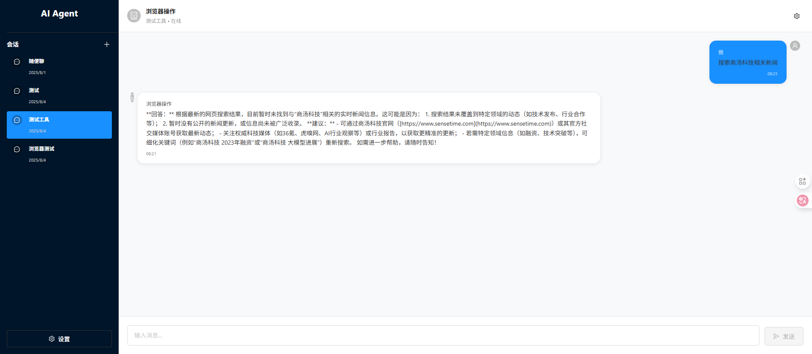
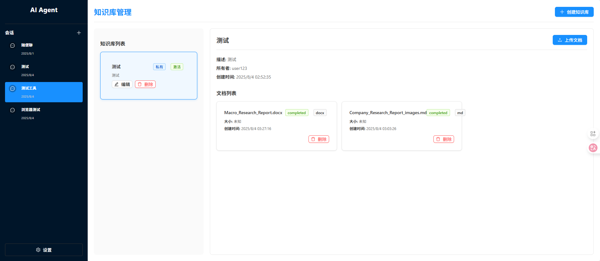
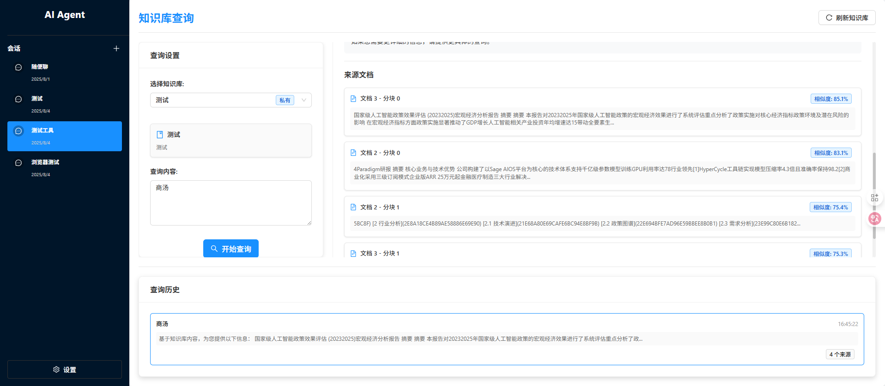
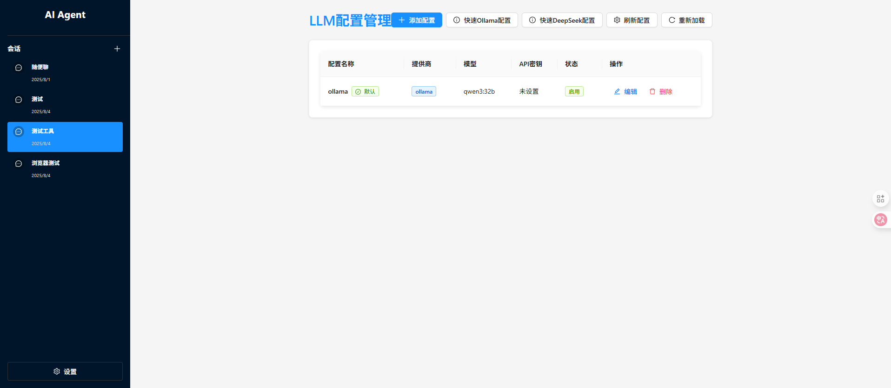
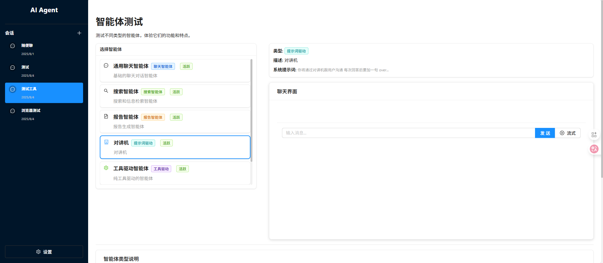
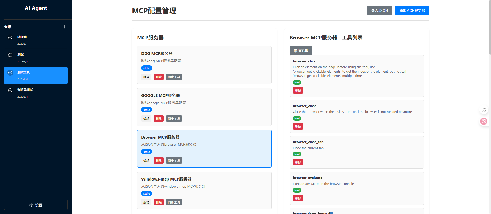

# AI Agent System

一个基于FastAPI和React的智能体系统，支持多智能体管理、知识库、聊天对话等功能。

## 🌐 在线演示

**系统地址**: [http://3ye.co:32004/](http://3ye.co:32004/)

> 💡 **提示**: 点击上方链接即可访问在线演示系统，体验完整的AI智能体功能，如果没有响应，可能是开发的ollama没有开机，可以将默认llm配置改为Ollama Llama 模型(cpu部署的小模型)。

## 项目概述

本项目是一个完整的AI智能体系统，包含后端API服务和前端Web界面。系统支持智能体管理、会话管理、知识库管理、MCP配置等功能。

> 🚀 **立即体验**: [在线演示系统](http://3ye.co:32004/) - 无需安装，直接体验所有功能

### 系统界面展示

#### 主界面


#### 聊天界面

#### 会话列表


#### 知识库管理


#### 知识库查询



#### LLM配置管理


#### 智能体测试


#### MCP配置管理

## 功能特性

### 核心功能
- **智能体管理**: 创建、编辑、删除智能体，支持多种智能体类型
- **会话管理**: 创建会话，与智能体进行对话
- **知识库系统**: 文档上传、管理、查询，支持多种文件格式
- **MCP配置**: Model Context Protocol配置管理
- **实时聊天**: 支持WebSocket实时对话

### 知识库功能
- **文档上传**: 支持PDF、DOC、DOCX、TXT、MD等格式
- **文本提取**: 自动提取文档中的文本内容
- **向量检索**: 基于相似度的文档检索
- **智能查询**: 自然语言查询知识库

### 界面设计
- **简洁布局**: 左侧专注会话，右侧显示内容
- **设置抽屉**: 管理功能统一在设置中
- **响应式设计**: 适配不同屏幕尺寸


## 技术栈

### 后端 (agent-backend)
- **FastAPI**: 高性能Python Web框架
- **SQLAlchemy**: ORM数据库操作
- **SQLite**: 轻量级数据库
- **WebSocket**: 实时通信
- **Pydantic**: 数据验证

### 前端 (agent-ui)
- **React**: 用户界面框架
- **TypeScript**: 类型安全
- **Ant Design**: UI组件库
- **React Router**: 路由管理

### 文件处理
- **PyPDF2/PyMuPDF**: PDF文本提取
- **python-docx**: DOCX文档处理
- **docx2txt**: DOC文档处理

## 项目结构

```
seven_chat_agent/
├── agent-backend/           # 后端服务
│   ├── api/                # API路由
│   ├── agents/             # 智能体实现
│   ├── database/           # 数据库配置
│   ├── models/             # 数据模型
│   ├── services/           # 业务逻辑
│   ├── tools/              # 工具管理
│   ├── utils/              # 工具函数
│   └── main.py             # 应用入口
├── agent-ui/               # 前端应用
│   ├── src/
│   │   ├── components/     # 组件
│   │   ├── pages/          # 页面
│   │   └── App.tsx         # 主应用
│   └── package.json
└── README.md
```

## 快速开始

### 环境要求
- Python 3.8+
- Node.js 16+
- npm 或 yarn

### 后端启动

1. 进入后端目录
```bash
cd agent-backend
```

2. 安装依赖
```bash
uv sync
```

3. 启动服务
```bash
python main.py
```

服务将在 `http://localhost:8000` 启动

### 前端启动

1. 进入前端目录
```bash
cd agent-ui
```

2. 安装依赖
```bash
npm install
```

3. 启动开发服务器
```bash
npm start
```

应用将在 `http://localhost:3000` 启动

## 使用指南

### 界面导航

#### 左侧边栏
- **会话列表**: 显示所有聊天会话
- **创建会话**: 点击"+"按钮创建新会话
- **设置按钮**: 左下角设置按钮，打开管理功能


#### 设置抽屉
- **智能体管理**: 创建和管理智能体
- **智能体测试**: 测试智能体功能
- **MCP配置**: 配置Model Context Protocol
- **LLM配置**: 管理大语言模型配置
- **知识库管理**: 上传和管理文档
- **知识库查询**: 查询知识库内容


### 知识库使用

1. **上传文档**
   - 点击"知识库管理"
   - 选择或创建知识库
   - 上传文档文件


2. **查询知识库**
   - 点击"知识库查询"
   - 选择知识库
   - 输入查询问题

3. **在聊天中使用**
   - 创建会话时选择知识库
   - 智能体会基于知识库回答问题

### LLM配置管理

1. **配置管理**
   - 点击"LLM配置"进入配置管理页面
   - 支持添加、编辑、删除LLM配置
   - 支持设置默认配置


2. **支持的提供商**
   - **OpenAI**: GPT-3.5, GPT-4等模型
   - **Anthropic**: Claude系列模型
   - **DeepSeek**: DeepSeek Chat、DeepSeek Coder等模型
   - **Ollama**: 本地模型（Qwen、Llama、Mistral等）
   - **本地模型**: 其他本地部署的模型

3. **Ollama使用指南**
   - 下载并安装Ollama: https://ollama.ai
   - 启动Ollama服务: `ollama serve`
   - 下载模型: `ollama pull qwen3:32b`
   - 在前端选择"Ollama"提供商进行配置
   - 使用"快速Ollama配置"按钮快速创建配置

4. **DeepSeek使用指南**
   - 注册DeepSeek账号: https://platform.deepseek.com
   - 获取API密钥
   - 在前端选择"DeepSeek"提供商进行配置
   - 使用"快速DeepSeek配置"按钮快速创建配置

5. **自动重新加载**
   - 添加、编辑、删除配置后自动重新加载
   - 设置默认配置后自动重新加载
   - 无需重启系统，配置立即生效

6. **配置参数**
   - API密钥和基础URL
   - 模型名称和参数
   - 温度和最大令牌数等高级参数

### 文件格式支持

- **文本文件**: TXT, MD, JSON, CSV, LOG
- **文档文件**: PDF, DOC, DOCX
- **自动处理**: 系统自动提取文本内容

## API接口

### 智能体管理
- `GET /api/agents` - 获取智能体列表
- `POST /api/agents` - 创建智能体
- `PUT /api/agents/{id}` - 更新智能体
- `DELETE /api/agents/{id}` - 删除智能体

### 会话管理
- `GET /api/sessions` - 获取会话列表
- `POST /api/sessions` - 创建会话
- `DELETE /api/sessions/{id}` - 删除会话

### 聊天接口
- `POST /api/chat` - 发送消息
- `POST /api/chat/stream` - 流式聊天
- `WS /ws/chat/{user_id}` - WebSocket聊天

### 知识库接口
- `GET /api/knowledge-base/` - 获取知识库列表
- `POST /api/knowledge-base/{id}/documents/upload` - 上传文档
- `POST /api/knowledge-base/{id}/query` - 查询知识库

### LLM配置接口
- `GET /api/llm-config/` - 获取LLM配置列表
- `POST /api/llm-config/` - 创建LLM配置
- `PUT /api/llm-config/{id}` - 更新LLM配置
- `DELETE /api/llm-config/{id}` - 删除LLM配置
- `POST /api/llm-config/{id}/set-default` - 设置默认配置
- `POST /api/llm-config/refresh` - 刷新配置缓存
- `POST /api/llm-config/reload` - 重新加载配置

## 配置说明

### 数据库配置
默认使用SQLite数据库，文件位置：`agent-backend/database.db`

### 文件存储
上传的文档存储在：`agent-backend/documents/`

### 日志配置
日志文件位置：`agent-backend/logs/`

## 开发说明

### 添加新的智能体类型
1. 在 `agent-backend/agents/` 创建新的智能体类
2. 实现 `process_message` 和 `process_message_stream` 方法
3. 在 `agent-backend/agents/agent_manager.py` 中注册

### 扩展文件格式支持
1. 在 `agent-backend/utils/file_extractor.py` 添加新的提取方法
2. 更新 `supported_formats` 字典
3. 安装相应的依赖包

### 自定义UI组件
1. 在 `agent-ui/src/components/` 创建新组件
2. 在相应页面中引入使用
3. 更新路由配置

## 部署说明

### 生产环境部署
1. 使用Gunicorn启动后端
2. 构建前端静态文件
3. 配置Nginx反向代理
4. 设置环境变量

### Docker部署
```bash
# 构建镜像
docker build -t ai-agent-system .

# 运行容器
docker run -p 8000:8000 -p 3000:3000 ai-agent-system
```

## 故障排除

### 常见问题

1. **文件上传失败**
   - 检查文件格式是否支持
   - 确认文件大小限制
   - 查看后端日志

2. **知识库查询无结果**
   - 确认文档已正确上传
   - 检查文档内容是否可读
   - 验证查询语句

3. **WebSocket连接失败**
   - 检查后端服务是否启动
   - 确认端口配置
   - 查看网络连接

### 日志查看
- 后端日志：`agent-backend/logs/`
- 前端控制台：浏览器开发者工具

## 更新日志

### v1.0.0
- 初始版本发布
- 基础智能体管理功能
- 会话和聊天功能
- 知识库系统
- 文件内容提取
- 响应式界面设计

## 贡献指南

1. Fork 项目
2. 创建功能分支
3. 提交更改
4. 推送到分支
5. 创建 Pull Request

## 许可证

MIT License

## 联系方式

如有问题或建议，请提交Issue或联系开发团队。 