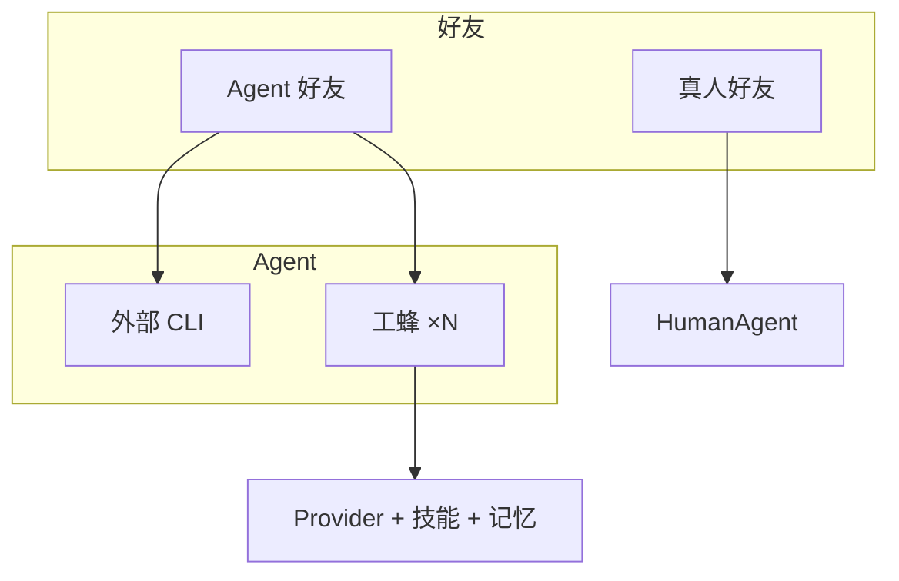

# Seven Chat Agent

[](https://github.com/sanyexieai/seven_chat_agent)

**在线体验**：[https://3ye.co:18743/](https://3ye.co:18743/)

类微信的多 Agent 聊天室：把 **AI 助手**（外部 CLI 或自研 **工蜂**）和 **真人好友** 放在同一块屏幕里聊天；支持私聊、群聊，群聊里多位 AI 会按规则轮流发言，真人输入时自动礼让。

---

## 能做什么

| 场景 | 说明 |
| --- | --- |
| **私聊** | 和任意一位好友（AI 或真人）一对一聊天 |
| **群聊** | 拉多位好友进群，由调度器控制发言顺序，避免刷屏 |
| **多种 AI 来源** | Claude Code、Codex、Cursor Agent 等外部 CLI；或工蜂（记忆 + 技能 + 多家大模型 API） |
| **真人参与** | 生成邀请链接，朋友在浏览器里以「真人好友」身份进群 |
| **内置助理 Hex** | 开箱即用的工蜂助理，可配置技能与长期记忆 |

---

## 三种使用方式

共用同一套核心能力，按你的习惯选一种即可：

1. **浏览器（Web）** — 访问已部署的服务，或本地启动后端 + 前端（见下方「本地运行」）。
2. **桌面应用** — Tauri 壳，内嵌服务，安装后打开即用，数据在本地。
3. **终端（TUI）** — 在 SSH 等环境里用键盘操作，连接本机或远程服务。

---

## 上手（Web）

在 [在线体验](https://3ye.co:18743/) 或自建实例上：

1. 打开页面，进入右上角 **设置**，为需要的模型平台填写 API Key（也可在服务器环境变量中预先配置，见 [.env.example](.env.example)）。
2. 点击 **＋ 好友**，选择后端类型（CLI / 工蜂 / 真人等）并创建。
3. 选中好友开始私聊，或通过左下角 **＋ 群聊** 组群。

**真人好友**：新建类型为「真人」的好友 → 左上角 **邀请** 生成链接 → 将  
`https://<你的站点>/?human=<邀请码>`  
发给对方，对方在浏览器中即可发言。

---

## 本地运行

需要 Rust 1.80+、Node 20+。

```bash
# 后端（默认 http://127.0.0.1:18737）
cargo run --bin seven-chat-agent-server

# 前端（默认 http://127.0.0.1:18738，代理 /api、/ws）
cd web && npm install --no-bin-links && npm run dev
```

浏览器打开 <http://127.0.0.1:18738>。首次运行会在 `data/` 下创建数据库，并预置常用模型平台与助理 **Hex**。

可选：复制根目录 `.env.example` 为 `.env` 填入 API Key，再启动 `seven-chat-agent-server`。

### 桌面版

```bash
cd apps/seven-chat-agent-desktop
cargo tauri dev    # 调试
cargo tauri build  # 打包（MSI / dmg / AppImage / deb 等）
```

需安装 [Tauri CLI 2](https://v2.tauri.app/) 与对应系统 WebView 依赖。

### 终端版

```bash
cargo run --bin seven-chat-agent-tui
# 连接远程：SEVEN_CHAT_AGENT_SERVER=https://你的域名/ cargo run --bin seven-chat-agent-tui
```

常用键：`j/k` 选好友、`Enter`/`i` 输入、`d` 调试面板、`q` 退出。

---

## 配置要点

环境变量前缀为 `SEVEN_CHAT_AGENT_*`（兼容旧前缀 `HONEYCOMB_*`）。常用项：

| 变量 | 默认 | 含义 |
| --- | --- | --- |
| `SEVEN_CHAT_AGENT_BIND` | `127.0.0.1:18737` | 服务监听地址 |
| `SEVEN_CHAT_AGENT_DB` | `sqlite://data/seven_chat_agent.db` | 数据库 |
| `SEVEN_CHAT_AGENT_DATA` | `data` | 数据目录 |

**API Key**：在 Web 设置中填写优先；未填时按 `<PROVIDER_ID>_API_KEY` 读取环境变量（如 `OPENAI_API_KEY`、`ANTHROPIC_API_KEY`）。完整列表见 [.env.example](.env.example)。

**好友类型简述**

- **Agent**：外部 CLI（Claude / Codex / Cursor）或 **工蜂**（`worker-bee-cli`，可绑 Provider + 模型 + 技能库）。
- **真人**：仅通过邀请链接在浏览器中发言。

---

## 自托管与 Docker

若要在自己的服务器上部署（含 HTTPS、CLI 转发等），见 [docs/deploy-docker.md](docs/deploy-docker.md)。

---

## 文档与仓库

| 资源 | 说明 |
| --- | --- |
| [CHANGELOG.md](CHANGELOG.md) | 版本更新记录 |
| [docs/deploy-docker.md](docs/deploy-docker.md) | Docker 镜像与自动部署 |
| [docs/](docs/) | 架构与设计说明（多租户、记忆分层、群助理等） |
| [crates/worker-bee-cli/README.md](crates/worker-bee-cli/README.md) | 工蜂 CLI 独立使用说明 |

源码仓库：[github.com/sanyexieai/seven_chat_agent](https://github.com/sanyexieai/seven_chat_agent)

---

## 开发者速览

<details>
<summary>仓库结构、REST/WS API、架构图（点击展开）</summary>

### 仓库结构

```
seven_chat_agent/
├── crates/seven-chat-agent-core/    # 领域模型、存储、Provider、调度
├── crates/seven-chat-agent-server/  # HTTP + WebSocket
├── crates/seven-chat-agent-tui/     # 终端客户端
├── crates/worker-bee-cli/           # 工蜂 CLI
├── apps/seven-chat-agent-desktop/   # Tauri 桌面
├── web/                             # React 前端
└── migrations/                      # 数据库迁移
```

### 架构（好友与运行时）


```mermaid
flowchart TB
    subgraph friends["好友"]
        AG["Agent 好友"]
        HU["真人好友"]
    end
    subgraph agent["Agent"]
        EXT["外部 CLI"]
        WB["工蜂 ×N"]
    end
    AG --> EXT
    AG --> WB
    HU --> HUM["HumanAgent"]
    WB --> PR["Provider + 技能 + 记忆"]
```

### API 端点（节选）

| 路径 | 用途 |
| --- | --- |
| `GET /api/health` | 健康检查 |
| `/api/friends`、`/api/groups`、`/api/conversations` | 好友、群聊、会话 |
| `/api/providers`、`/api/provider_keys` | 模型平台与密钥 |
| `/api/invites`、`/api/human/:code/*` | 真人邀请与客户端 |
| `WS /ws` | 消息流、群聊调度事件 |

完整路由见 `crates/seven-chat-agent-server` 源码。

</details>
