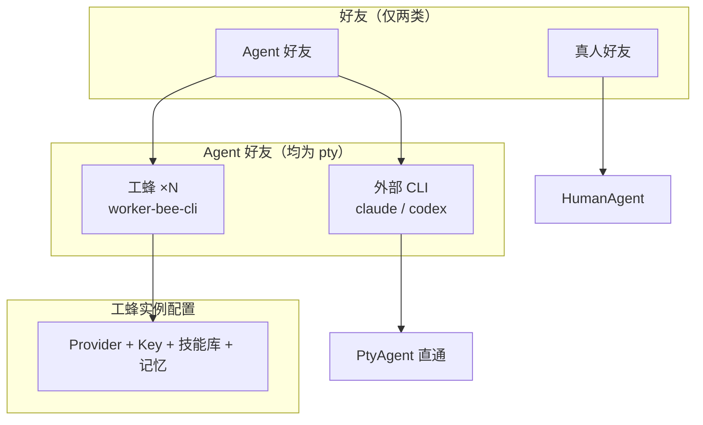

# Seven Chat Agent

[](https://github.com/sanyexieai/seven_chat_agent)

> 类微信的多 Agent 聊天室：**Agent 好友**（外部 CLI 或 **工蜂** 实例）与**真人好友**同屏聊天；工蜂可选 codex / claude 式外部 CLI，或自研 **Worker Bee**（记忆 + MCP + Skill）。

**v2（本仓库主线）**：Rust 重写，仓库 [sanyexieai/seven_chat_agent](https://github.com/sanyexieai/seven_chat_agent)。  
**v1（已归档）**：FastAPI + React（`agent-backend` / `agent-ui`），见 Git 标签 **`v1.0.0`** 或在线演示 [3ye.co:32004](http://3ye.co:32004/)。

目录、Cargo 包与二进制统一为 `seven-chat-agent-*`（与仓库名 `seven_chat_agent` 对应）。环境变量前缀为 `SEVEN_CHAT_AGENT_*`（仍兼容 `HONEYCOMB_*`）。变更记录见 [CHANGELOG.md](CHANGELOG.md)。

## 形态

Seven Chat Agent 有三种形态，共用同一份 Rust 内核 `seven-chat-agent-core`：

1. **Web** — `crates/seven-chat-agent-server` 起 HTTP + WebSocket，`web/` 是 React 前端，浏览器访问。
2. **桌面** — `apps/seven-chat-agent-desktop` 是 Tauri 2 壳，直接把 `seven-chat-agent-server::build_app()` 编进进程并启动本地服务，Webview 加载前端。
3. **终端** — `crates/seven-chat-agent-tui` 用 ratatui，通过 HTTP/WS 连上服务（本地或远端），可在 SSH 中跑。

## 里程碑

| M | 内容 | 状态 |
| --- | --- | --- |
| M1 | Cargo workspace + SQLite schema + 核心骨架 + Provider 层 + OpenAI 兼容 + HTTP/WS + 前端 DM | ✓ |
| M2 | PtyAgent（oneshot 模式） + claude/cursor/codex-exec PtyAdapter 预设 + ANSI 去除 | ✓ |
| M3 | 群聊数据模型 + SpeakerScheduler（judge_threshold、turn 预算、per-agent 上限、cooldown、相似度去重、递归防护） + "思考中"指示器 + 群设置面板 | ✓ |
| M4 | Provider 矩阵：Anthropic / Gemini / Ollama / OpenAI 兼容 / OpenRouter / 多本地引擎；速率限制（令牌桶）、多 key 选择、按用量记账、OS keychain（feature gate）；ApiAgent 主备降级 | ✓ |
| M5 | AssistantAgent：三层记忆（会话/SQLite+FTS5 持久/磁盘 Skills）、记忆抽取与自动衰减、SKILL.md 加载与触发匹配、skills_guard 40+ 危险模式、元认知反思 | ✓ |
| M6 | HumanAgent：一次性邀请码 + 真人 web 客户端、presence/typing/已读基础、群聊"真人优先 / 真人不被 judge"调度 | ✓ |
| M7 | Tauri 2 桌面壳：嵌入 seven-chat-agent-server 库，本地启动 `127.0.0.1:18739`，配置 Windows MSI / NSIS / macOS dmg / Linux AppImage / deb 打包 | ✓ |
| M8 | ratatui 终端壳：好友列表 + DM + WebSocket 流式 + judgment/scheduler 调试面板；`seven-chat-agent-tui export/import` 配置导入导出 | ✓ |

## 快速跑起来

需要 Rust 1.80+，Node 20+，SQLite（系统库由 sqlx 自带，无需额外安装）。

```bash
# 可选：工蜂本地 CLI（shell/skill 工具链；日常对话走 Provider API，不依赖此二进制）
# cargo build -p worker-bee-cli --bin worker-bee

# 后端：监听 127.0.0.1:18737
cargo run --bin seven-chat-agent-server

# 前端：监听 127.0.0.1:18738，自动代理 /api 和 /ws 到后端
cd web
npm install --no-bin-links
npm run dev
```

浏览器打开 <http://127.0.0.1:18738>。首启会创建 `data/seven_chat_agent.db`，并预置 10 个 Provider 与内置助理 **Hex**。

到右上角"设置"为某个 Provider 添加 API Key，再点"＋ 好友"挑一个后端（CLI / API / 真人），就能开聊；左下角"＋ 群聊"拉好友组群。

### 桌面应用

```bash
cd apps/seven-chat-agent-desktop
cargo tauri dev      # 开发
cargo tauri build    # 打包 MSI / dmg / AppImage / deb / NSIS
```

需要先 `cargo install tauri-cli --version "^2"` 与系统 webview 依赖（macOS 内置；Linux 需要 `webkit2gtk-4.1` + `libsoup-3.0` + `librsvg2-dev` + `libdbus-1-dev`；Windows 需要 WebView2）。

桌面壳启动时会：

1. 解析系统 app data 目录，把 SQLite 写到 `<app_data>/seven_chat_agent.db`、把 vault 与 skills 文件放到同一目录；
2. 同步等待内嵌 HTTP server bind 到 `127.0.0.1:18739` 再让 webview 加载，避免初次启动竞态；
3. webview 加载的是 server 自己用 `include_dir!()` 烧进二进制的 `web/dist/`，所以即使部署目录没有 `web/dist/` 也能跑。

如果改图标，把新 PNG/ICO/ICNS 放在 `apps/seven-chat-agent-desktop/src-tauri/icons/` 下，文件名沿用 `tauri.conf.json` 中的 `bundle.icon` 列表。仓库自带的是占位图标（蜂巢轮廓加 h 字），打 Release 之前替换成正式品牌图标即可。

### 终端 UI

```bash
# 默认连本地 server
cargo run --bin seven-chat-agent-tui

# 连远端 server
SEVEN_CHAT_AGENT_SERVER=https://my-honeycomb.example/ cargo run --bin seven-chat-agent-tui

# 导出 / 导入配置
cargo run --bin seven-chat-agent-tui -- export --out cfg.json
cargo run --bin seven-chat-agent-tui -- import cfg.json
```

操作键：`j/k` 选好友、`Enter` 或 `i` 进入输入模式、`d` 切换调试面板（看 judgment / scheduler 选择历史）、`Esc` 退出输入模式、`q` 退出程序。

### 真人好友邀请

1. 在"好友"里新建一个后端类型为「真人」的好友。
2. 点左上角"邀请"按钮，生成一条邀请链接（24 字符随机码，可设置过期时间）。
3. 把 `https://<你的服务地址>/?human=<code>` 发给真人朋友，对方打开后即可作为这位好友身份在群里发消息；正在输入时会触发"真人礼让"，AI 自动延迟出声。

## 环境变量

复制示例并按需填写密钥：

```bash
cp .env.example .env
# 编辑 .env 后启动；seven-chat-agent-server 会自动加载项目根目录的 .env
cargo run --bin seven-chat-agent-server
```

### 支持的 API Key（环境变量）

内置 Provider 在 **Web 设置未配置 Key** 时，回退读取环境变量。命名规则：`<PROVIDER_ID>_API_KEY`（id 转大写、`-` 改 `_`）。

| Provider id | 平台 | 环境变量 |
|-------------|------|----------|
| `openai` | OpenAI | `OPENAI_API_KEY` |
| `anthropic` | Anthropic Claude | `ANTHROPIC_API_KEY` |
| `gemini` | Google Gemini | `GEMINI_API_KEY` |
| `deepseek` | DeepSeek | `DEEPSEEK_API_KEY` |
| `qwen` | 通义千问 | `QWEN_API_KEY` |
| `moonshot` | Moonshot Kimi | `MOONSHOT_API_KEY` |
| `openrouter` | OpenRouter | `OPENROUTER_API_KEY` |
| `ollama` | Ollama | `OLLAMA_API_KEY`（通常留空） |
| `lmstudio` | LM Studio | `LMSTUDIO_API_KEY`（通常留空） |
| `vllm` | vLLM | `VLLM_API_KEY`（通常留空） |

自定义 Provider 同理，例如 id 为 `my-api` 则用 `MY_API_API_KEY`。完整列表见 [.env.example](.env.example)。

| 变量 | 默认 | 含义 |
| --- | --- | --- |
| `SEVEN_CHAT_AGENT_BIND` | `127.0.0.1:18737` | 后端监听地址 |
| `SEVEN_CHAT_AGENT_DB`   | `sqlite://data/seven_chat_agent.db` | SQLite 数据库 URL |
| `SEVEN_CHAT_AGENT_DATA` | `data` | 数据目录 |
| `SEVEN_CHAT_AGENT_VAULT` | `data/vault.json` | 本地凭据文件（启用 `keychain` feature 后会改走 OS keychain） |
| `SEVEN_CHAT_AGENT_SERVER` | `http://127.0.0.1:18737` | TUI / 其他客户端连接的服务端 URL |
| `SEVEN_CHAT_AGENT_STATIC_DIR` | 自动探测 `./web/dist` / `../web/dist` / `../../web/dist` | 让 `seven-chat-agent-server` 直接托管前端静态资源；桌面壳里则用编译期内嵌（见下文） |
| `SEVEN_CHAT_AGENT_CLI_CWD` | — | 所有 Pty 好友共用的工作目录（会建目录并默认 `git init`）；优先于自动工作区 |
| `SEVEN_CHAT_AGENT_CLI_WORKSPACE_ROOT` | `{SEVEN_CHAT_AGENT_DATA}/cli-workspaces` | 每位 Pty 好友自动工作区的父目录（子目录名为好友 `id`） |
| `SEVEN_CHAT_AGENT_CLI_AUTO_GIT` | `1`（开启） | 新建/确保工作区时是否执行 `git init`；设 `0` 关闭 |
| `SEVEN_CHAT_AGENT_SKILLS_DIR` | `data/skills` | 统一运行时技能库根目录 |

## 统一 Agent 运行时（`seven-chat-agent-core/src/runtime`）

**好友类型**

| 类型 | 实现 | 说明 |
|------|------|------|
| **Agent 好友** | `UnifiedAgent` + `AgentRuntime` | `pty`：外部 CLI 或 **工蜂**（`worker-bee-cli`）；遗留 `api` 按工蜂处理 |
| **真人好友** | `HumanAgent` | 邀请链接，浏览器登场 |

**CLI 引擎**（`pty` + `preset`）

| preset | 说明 |
|--------|------|
| `claude` | 外部 Claude Code（直通，不经平台 API 配置层） |
| `codex-exec` | 外部 OpenAI `codex exec`（直通）；好友可配 `cli_sandbox_mode`、`cli_session_mode=resume` |
| `cursor` | Cursor Agent CLI（`agent` / `cursor-agent`；需 `curl -fsSL https://cursor.com/install \| bash`） |
| `worker-bee-cli` | **工蜂 CLI 实例**（自研；每个好友 = 一个实例） |

**平台 API（Provider）** 不是与 CLI 平级的「API 好友」，而是挂在 **工蜂 CLI 实例** 下的配置：在好友里选 `worker-bee-cli` 后，再选 Provider + Model + Key（也可在「设置」里管理 Key）。可创建多个好友，即多个工蜂实例，各自绑定不同 API。

**内置 Hex**：普通工蜂 Agent（`pty` + `worker-bee-cli`），在 `backend_config` 里配置技能库 / 记忆；与其它工蜂实例同一套模型。

- CLI 工作区默认 `data/cli-workspaces/<好友ID>/`（自动建目录 + `git init`）

### 架构图


```mermaid
flowchart TB
    subgraph friends["好友（仅两类）"]
        AG["Agent 好友"]
        HU["真人好友"]
    end

    subgraph agent["Agent 好友（均为 pty）"]
        EXT["外部 CLI<br/>claude / codex"]
        WB["工蜂 ×N<br/>worker-bee-cli"]
    end

    subgraph wb_cfg["工蜂实例配置"]
        PR["Provider + Key + 技能库 + 记忆"]
    end

    AG --> EXT
    AG --> WB
    HU --> HUM["HumanAgent"]

    WB --> PR
    EXT --> PTY["PtyAgent 直通"]
```

详见上文「统一 Agent 运行时」与仓库 `crates/seven-chat-agent-core/src/runtime/`。

### Worker Bee CLI（独立 crate，工蜂）

```bash
cargo build -p worker-bee-cli --release
# 安装到 PATH 后即可在 CLI 好友 / 助理里选 preset=worker-bee-cli
./target/release/worker-bee exec "你好" --json --skip-git-repo-check
```

源码：`crates/worker-bee-cli/`（库 + `worker-bee` 可执行文件）。说明见该目录 `README.md`。
| `SEVEN_CHAT_AGENT_ASSISTANT_PROVIDER` / `SEVEN_CHAT_AGENT_ASSISTANT_MODEL` | — | Hex 助理在 backend_config 里没指定时的兜底 |

## 前端托管

`seven-chat-agent-server` 既是 REST/WS 后端，也兼任前端的静态资源服务器：

1. **开发模式**：`npm run dev` 起 vite 自己代理 `/api`、`/ws`，server 不需要再托管前端。
2. **后端 + 已构建前端**：先在 `web/` 里 `npm run build`，然后直接跑 `cargo run --bin seven-chat-agent-server`。server 会自动探测 `./web/dist`，浏览器打开 `http://127.0.0.1:18737/` 就能直接出页面，不必再起 vite。
3. **桌面壳 / 单文件部署**：`seven-chat-agent-server` 的 `embed-frontend` feature 会在编译期把 `web/dist/` 通过 `include_dir!()` 烧进二进制；桌面壳（`apps/seven-chat-agent-desktop`）默认就启用这个 feature，因此 `cargo tauri build` 出来的安装包不依赖运行时存在 `web/dist`。

如要在自定义部署里嵌入前端：

```bash
cd web && npm install --no-bin-links && npm run build && cd ..
cargo build --release -p seven-chat-agent-server --features embed-frontend
```

## 仓库结构

```
seven_chat_agent/                   # 克隆目录名可与仓库一致
├── Cargo.toml                      workspace（v2.0.0）
├── crates/
│   ├── seven-chat-agent-core/             领域模型 / store / provider / agent / dispatcher / scheduler
│   │   └── src/
│   │       ├── agent/
│   │       │   ├── api.rs          API 模型 agent（含 model_chain 降级）
│   │       │   ├── pty.rs          oneshot pty agent（claude/cursor/codex-exec 预设）
│   │       │   ├── human.rs        真人 agent（不参与 judge，等待人类输入）
│   │       │   └── assistant/      （旧）助理实现；现由 runtime/ 统一
│   │       └── runtime/            统一 Agent 运行时：记忆 + 工具循环（shell/skill/cli/mcp）
│   │       ├── provider/
│   │       │   ├── openai_compat.rs
│   │       │   ├── anthropic.rs    原生 Anthropic Messages API
│   │       │   ├── gemini.rs       Google Gemini streaming
│   │       │   ├── ollama.rs       Ollama NDJSON streaming
│   │       │   └── rate_limit.rs   token-bucket per-key 限流
│   │       ├── scheduler.rs        群聊防风暴五件套
│   │       ├── dispatcher.rs       群聊与 DM 分发
│   │       └── store/              SQLite + sqlx + FTS5
│   ├── seven-chat-agent-server/           axum HTTP + WS（同时是 lib，桌面壳复用）
│   ├── seven-chat-agent-tui/              ratatui 终端壳
│   └── worker-bee-cli/             工蜂 Worker Bee CLI（`worker-bee` bin，memory/MCP/skill）
├── apps/
│   └── seven-chat-agent-desktop/          Tauri 2 桌面壳
├── web/                            React + Vite + Tailwind 前端
│   └── src/
│       ├── App.tsx                 主界面：Sidebar + ChatWindow + 各种弹层
│       ├── HumanApp.tsx            真人邀请 web 客户端
│       └── components/
│           ├── AssistantPanel.tsx  助理记忆/技能/反思浏览器
│           ├── GroupEditor.tsx     群聊调度参数编辑
│           ├── HumanInvitePanel.tsx 邀请码管理
│           └── ...
├── migrations/                     sqlx 迁移 SQL（providers / friends / groups / messages + FTS5 / memories + FTS5 / skills / human_sessions / invites）
├── data/                           运行时数据：DB、vault、skills/<friend_id>/*.md
└── README.md
```

## API 总览

`seven-chat-agent-server` 暴露的 REST + WS 端点：

| Method & Path | 用途 |
| --- | --- |
| `GET  /api/health` | 健康检查 |
| `GET  /api/friends`、`POST /api/friends`、`GET /api/friends/:id`、`DELETE /api/friends/:id` | 好友 CRUD |
| `GET  /api/groups`、`POST /api/groups`、`GET /api/groups/:id` | 群聊 CRUD |
| `GET  /api/providers` | 列 Provider |
| `GET  /api/provider_keys`、`POST /api/provider_keys`、`DELETE /api/provider_keys/:id` | API key 管理 |
| `GET  /api/conversations`、`GET /api/conversations/:id`、`GET /api/conversations/:id/messages`、`POST /api/conversations/:id/send` | 会话 |
| `GET  /api/conversations/dm/:friend_id`、`POST /api/conversations/dm/:friend_id` | 打开/在 DM 中发送 |
| `GET  /api/assistant/:friend_id/memories`、`POST/DELETE` | 助理记忆 |
| `GET  /api/assistant/:friend_id/skills`、`GET /api/assistant/:friend_id/reflections` | 助理技能与反思 |
| `POST /api/invites`、`GET /api/invites`、`DELETE /api/invites/:id` | 真人邀请 |
| `GET  /api/human/:code/state`、`POST /api/human/:code/send`、`POST /api/human/:code/typing` | 真人客户端 |
| `WS   /ws` | 全局事件总线：`message_created` / `message_delta` / `message_done` / `judgment_decided` / `scheduler_picked` / `turn_started` / `turn_ended` |

## 设计文档

完整架构、Hermes 风格"自主进化助理"以及真人好友接入方案，见 `.cursor/plans/honeycomb_多_agent_聊天室_*.plan.md`（内部规划文档，产品对外名称为 Seven Chat Agent）。

## 发布到 GitHub（v2）

```bash
git remote add origin https://github.com/sanyexieai/seven_chat_agent.git
# 若远程 main 仍是 v1：先在 GitHub 为当前 main 打 tag v1.0.0，再推送 v2
git push -u origin main
git tag v2.0.0
git push origin v2.0.0
```

在 GitHub 创建 Release **v2.0.0**，正文可粘贴 [CHANGELOG.md](CHANGELOG.md) 中 v2 一节。
