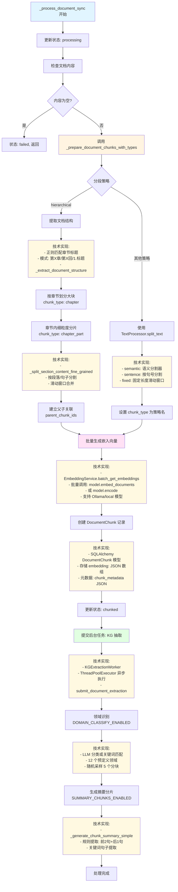
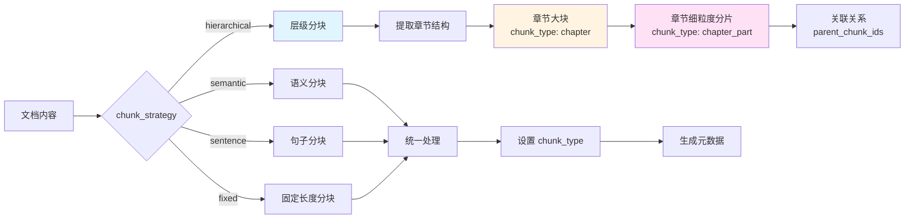
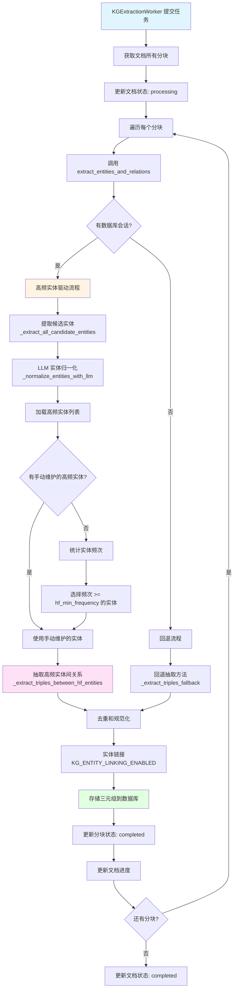
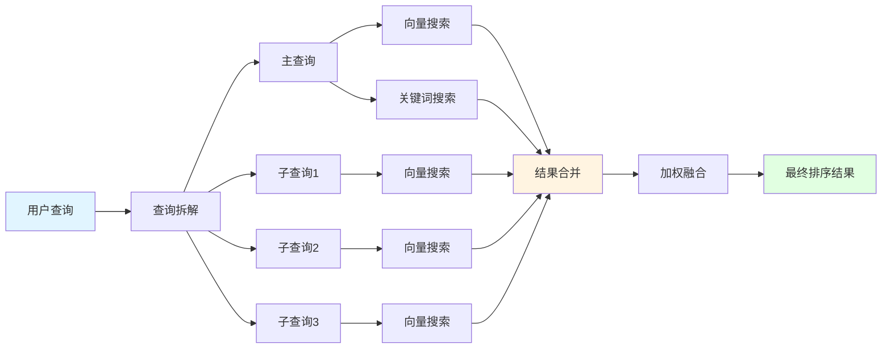
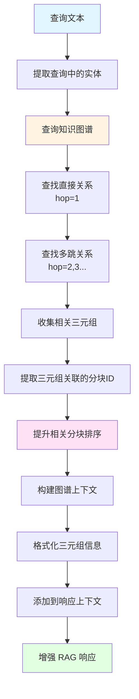
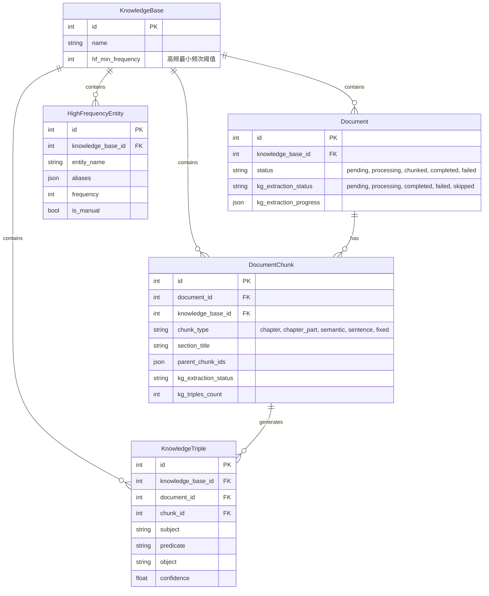

# 系统关键流程节点图

本文档描述了知识库系统的核心处理流程，包括文档处理、知识图谱提取和查询检索三个主要流程。

## 一、文档上传与处理流程

### 1.1 文档上传流程

```mermaid
flowchart TD
    A[前端上传文档] --> B[API: POST /api/knowledge-base/{kb_id}/documents/upload]
    B --> C[FileExtractor 提取文本内容]
    C --> C1[技术实现:<br/>- PDF: PyPDF2/pdfplumber<br/>- DOCX: python-docx<br/>- TXT: 直接读取]
    C1 --> D{提取成功?}
    D -->|是| E[创建 Document 记录]
    D -->|否| F[使用 Base64 编码作为备选]
    F --> E
    E --> E1[技术实现:<br/>- SQLAlchemy ORM<br/>- DocumentCreate Pydantic 模型<br/>- 状态字段: pending]
    E1 --> G[状态: pending]
    G --> H[触发同步处理: _process_document_sync]
    
    style A fill:#e1f5ff
    style C1 fill:#fff9e1
    style E1 fill:#fff9e1
    style H fill:#fff4e1
```

### 1.2 文档同步处理流程



### 1.3 文档分块策略详解



## 二、知识图谱提取流程

### 2.1 三元组抽取主流程



### 2.2 高频实体识别与归一化流程

```mermaid
flowchart TD
    A[文本输入] --> B[提取候选实体]
    B --> B1[规则提取<br/>_extract_entities_by_rules]
    B1 --> B2[技术实现:<br/>- 正则: [\u4e00-\u9fa5]{2,4}<br/>- 匹配 2-4 字中文词<br/>- 过滤停用词: 第一/第二等]
    B2 --> B3[过滤非实体词]
    
    B3 --> C[统计实体频次<br/>仅当前文本]
    C --> C1[技术实现:<br/>- defaultdict(int) 计数<br/>- 仅统计当前文本出现次数<br/>- 不查询数据库历史]
    C1 --> D[LLM 实体归一化]
    
    D --> D1[构建提示词<br/>包含所有候选实体]
    D1 --> D2[技术实现:<br/>- ThreadPoolExecutor 异步调用<br/>- get_llm_helper().call<br/>- 提示词: 识别相似概念<br/>- 输出 JSON 格式别名映射]
    D2 --> D3[生成别名映射<br/>alias_map]
    D3 --> D4[保存到 HighFrequencyEntity 表]
    D4 --> D5[技术实现:<br/>- SQLAlchemy ORM 插入<br/>- entity_name + aliases JSON<br/>- is_manual=False 标记自动]
    
    D5 --> E[加载知识库配置]
    E --> E1[读取 hf_min_frequency<br/>默认: 3]
    E1 --> F[合并手动维护的实体]
    F --> G[选择高频实体集合]
    G --> G1[技术实现:<br/>- 手动维护实体 + 自动识别<br/>- 频次 >= hf_min_frequency<br/>- 返回 Set[str] 集合]
    G1 --> H[返回高频实体列表]
    
    style A fill:#e1f5ff
    style B2 fill:#fff9e1
    style C1 fill:#fff9e1
    style D2 fill:#fff9e1
    style D5 fill:#fff9e1
    style G1 fill:#fff9e1
    style D fill:#fff4e1
    style D4 fill:#ffe1f5
    style H fill:#e1ffe1
```

### 2.3 三元组提取与过滤流程

```mermaid
flowchart TD
    A[文本 + 高频实体列表] --> B[识别文本中的高频实体<br/>考虑别名映射]
    B --> C[规则提取三元组<br/>_extract_triples_rule_based]
    
    C --> C1[匹配关系模式]
    C1 --> C2[技术实现:<br/>- 正则表达式模式库<br/>- 15+ 种关系模式<br/>- 如: (.+?)是(.+)<br/>- (.+?)(和|与)(.+?)(结义|结拜)<br/>- 事件实体识别: 桃园结义]
    C2 --> C3[提取主语、谓语、宾语]
    C3 --> C4[验证长度和格式]
    C4 --> C5[技术实现:<br/>- 长度限制: 2-20 字符<br/>- 过滤标点符号<br/>- 验证中文/字母/数字<br/>- _normalize_entity 清理]
    
    C5 --> D[过滤三元组]
    D --> D1{主语和宾语都是<br/>高频实体?}
    D1 -->|否| D2[丢弃]
    D1 -->|是| E[调整三元组<br/>_adjust_triples_with_hf_entities]
    
    E --> E1[别名归一化]
    E1 --> E2[技术实现:<br/>- 使用 alias_map 替换<br/>- 统一实体表示<br/>- 保留原始别名信息]
    E2 --> E3[调整置信度]
    E3 --> E4[技术实现:<br/>- 高频实体对: +0.1 置信度<br/>- 低频实体对: -0.2 置信度<br/>- 动态阈值过滤<br/>- 默认阈值: 0.6]
    E4 --> E5[过滤低置信度三元组]
    
    E5 --> G[返回三元组列表]
    G --> G1[技术实现:<br/>- List[Tuple[str, str, str, float]]<br/>- (subject, predicate, object, confidence)<br/>- 去重: set((s, p, o))]
    
    style A fill:#e1f5ff
    style C2 fill:#fff9e1
    style C5 fill:#fff9e1
    style E2 fill:#fff9e1
    style E4 fill:#fff9e1
    style G1 fill:#fff9e1
    style D fill:#fff4e1
    style E fill:#ffe1f5
    style G fill:#e1ffe1
```

## 三、查询检索流程

### 3.1 查询主流程

```mermaid
flowchart TD
    A[用户查询] --> B[query_knowledge_base]
    B --> C[QueryProcessor 处理查询]
    C --> D[查询拆解<br/>LLM_QUERY_DECOMPOSE_ENABLED]
    D --> D1[技术实现:<br/>- LLM 拆解为 3-5 个关键词<br/>- 正则提取中文关键词<br/>- 过滤停用词]
    
    D1 --> E[并行多路召回]
    E --> E1[主查询向量搜索]
    E1 --> E1T[技术实现:<br/>- EmbeddingService.get_embedding<br/>- _search_chunks_from_db<br/>- 余弦相似度计算<br/>- numpy.dot + linalg.norm]
    E --> E2[主查询关键词搜索]
    E2 --> E2T[技术实现:<br/>- _search_by_keywords<br/>- SQL LIKE 查询<br/>- 关键词匹配计数<br/>- 归一化相似度]
    E --> E3[子查询向量搜索<br/>基于拆解结果]
    E3 --> E3T[技术实现:<br/>- ThreadPoolExecutor 并行<br/>- 每个子查询独立向量搜索<br/>- 权重: 0.9]
    
    E1T --> F[合并搜索结果]
    E2T --> F
    E3T --> F
    
    F --> G[加权融合]
    G --> G1[向量结果: 权重 1.0]
    G1 --> G2[关键词结果: 权重 0.8]
    G2 --> G3[精确匹配提升: +20%]
    G3 --> G4[子查询结果: 权重 0.9]
    G4 --> G5[技术实现:<br/>- 字典融合: all_results[cid]<br/>- 保留最高分<br/>- 混合来源标记: hybrid<br/>- 加权融合公式]
    
    G5 --> H[知识图谱增强<br/>KNOWLEDGE_GRAPH_ENABLED]
    H --> H1[多跳三元组查询]
    H1 --> H2[提取相关分块ID]
    H2 --> H3[提升相关分块排序<br/>+0.1 相似度]
    H3 --> H4[技术实现:<br/>- _multi_hop_triple_search<br/>- SQL 查询 KnowledgeTriple<br/>- 通过 subject/object 关联<br/>- 最大跳数: MULTI_HOP_MAX_HOPS]
    
    H4 --> I[重排序<br/>RERANKER_ENABLED]
    I --> I1[技术实现:<br/>- CrossEncoder 模型<br/>- sentence_transformers<br/>- 模型: cross-encoder/ms-marco-MiniLM-L-6-v2<br/>- predict(query, passage) 对<br/>- 按 rerank_score 排序]
    I1 --> J[选取 Top-K 结果]
    J --> K[构建响应上下文]
    K --> L[知识图谱上下文增强]
    L --> M[生成最终响应]
    
    style A fill:#e1f5ff
    style D1 fill:#fff9e1
    style E1T fill:#fff9e1
    style E2T fill:#fff9e1
    style E3T fill:#fff9e1
    style G5 fill:#fff9e1
    style H4 fill:#fff9e1
    style I1 fill:#fff9e1
    style E fill:#fff4e1
    style H fill:#ffe1f5
    style M fill:#e1ffe1
```

### 3.2 多路召回策略详解



### 3.3 知识图谱增强查询流程



## 四、关键配置参数

### 4.1 文档处理配置

| 配置项 | 环境变量 | 默认值 | 说明 |
|--------|---------|--------|------|
| 分块策略 | `CHUNK_STRATEGY` | `hierarchical` | hierarchical, semantic, sentence, fixed |
| 分块大小 | `CHUNK_SIZE` | - | 分块的目标大小 |
| 重叠长度 | `CHUNK_OVERLAP` | - | 分块之间的重叠长度 |
| 领域识别 | `DOMAIN_CLASSIFY_ENABLED` | `true` | 是否启用领域分类 |
| 摘要生成 | `SUMMARY_CHUNKS_ENABLED` | `true` | 是否生成摘要分片 |

### 4.2 知识图谱配置

| 配置项 | 环境变量 | 默认值 | 说明 |
|--------|---------|--------|------|
| KG 抽取启用 | `KG_EXTRACT_ENABLED` | `true` | 是否启用知识图谱抽取 |
| 抽取模式 | `KG_EXTRACT_MODE` | `hybrid` | llm, rule, hybrid, model, ner_rule |
| LLM 回退 | `KG_LLM_FALLBACK_ENABLED` | `false` | hybrid 模式下是否使用 LLM 回退 |
| 实体链接 | `KG_ENTITY_LINKING_ENABLED` | `true` | 是否启用实体链接 |
| 最大跳数 | `KG_MAX_HOPS` | `3` | 多跳查询最大跳数 |
| 高频最小频次 | `hf_min_frequency` | `3` | 知识库级别配置，实体成为高频的最小出现次数 |

### 4.3 查询检索配置

| 配置项 | 环境变量 | 默认值 | 说明 |
|--------|---------|--------|------|
| 查询拆解 | `LLM_QUERY_DECOMPOSE_ENABLED` | `true` | 是否启用查询拆解 |
| 多路召回 | `MULTI_ROUTE_RECALL_ENABLED` | `true` | 是否启用多路召回 |
| 重排序启用 | `RERANKER_ENABLED` | `true` | 是否启用重排序 |
| 重排序候选数 | `RERANKER_AFTER_TOP_N` | `20` | 重排序前的候选数量 |
| 重排序 Top-K | `RERANKER_TOP_K` | `5` | 重排序后返回的数量 |
| 相似度阈值 | `SIMILARITY_THRESHOLD` | `0.3` | 相似度过滤阈值 |
| 知识图谱增强 | `KNOWLEDGE_GRAPH_ENABLED` | `true` | 是否启用知识图谱增强 |
| 多跳最大跳数 | `MULTI_HOP_MAX_HOPS` | `2` | 多跳查询最大跳数 |

## 五、数据模型关系

### 5.1 核心数据模型



## 六、关键设计决策

### 6.1 文档处理设计

1. **分层分块策略**：
   - 先按章节划分大块（`chapter`），再在章节内细粒度分片（`chapter_part`）
   - 通过 `parent_chunk_ids` 建立父子关联关系
   - 支持多种分块策略（hierarchical, semantic, sentence, fixed）

2. **异步处理**：
   - 文档分块和向量化同步完成，快速返回
   - 知识图谱抽取在后台异步进行，不阻塞文档处理

3. **状态管理**：
   - 文档状态：`pending` → `processing` → `chunked` → `completed`
   - KG 抽取状态：`pending` → `processing` → `completed` / `failed` / `skipped`

### 6.2 知识图谱提取设计

1. **高频实体驱动**：
   - 优先识别高频实体，只抽取高频实体之间的关系
   - 提高三元组质量和相关性
   - 支持手动维护和自动识别两种方式

2. **实体归一化**：
   - 使用 LLM 识别相似概念（如"刘备"和"玄德"）
   - 建立别名映射，统一实体表示
   - 持久化到 `HighFrequencyEntity` 表

3. **可配置阈值**：
   - 知识库级别配置 `hf_min_frequency`
   - 前端可配置，灵活调整高频实体识别标准

### 6.3 查询检索设计

1. **多路召回**：
   - 向量搜索 + 关键词搜索并行执行
   - 查询拆解后子查询并行搜索
   - 加权融合不同来源的结果

2. **知识图谱增强**：
   - 多跳查询发现相关实体关系
   - 提升相关分块的排序权重
   - 将图谱信息融入响应上下文

3. **重排序优化**：
   - 对 Top-N 候选结果进行重排序
   - 提升最终结果的准确性

## 七、性能优化点

1. **批量处理**：
   - 嵌入向量批量生成：`batch_get_embeddings` 一次性处理所有分块
   - 减少 API 调用次数，提升处理速度
   - 技术实现：`model.embed_documents(texts)` 或 `model.encode(texts)`

2. **并行执行**：
   - 多路召回并行：`ThreadPoolExecutor` 同时执行向量搜索和关键词搜索
   - 子查询并行：多个子查询同时进行向量搜索
   - 技术实现：`concurrent.futures.ThreadPoolExecutor(max_workers=2/3)`

3. **异步处理**：
   - KG 抽取后台异步：`KGExtractionWorker` 使用线程池异步处理
   - 不阻塞文档处理主流程
   - 技术实现：`ThreadPoolExecutor.submit()` + `Future` 回调

4. **缓存机制**：
   - 文档分析和规则生成结果缓存：`_document_cache` 字典缓存
   - 实体归一化结果持久化到数据库，避免重复 LLM 调用
   - 技术实现：`Dict[int, Dict[str, Any]]` + 线程锁保护

5. **降级策略**：
   - 嵌入失败时仍可完成分块和 KG 抽取
   - 查询时向量搜索失败回退到关键词搜索
   - 技术实现：try-except 捕获异常，提供备选方案

6. **数据库优化**：
   - 向量相似度计算：先加载所有分块，再批量计算相似度
   - 动态阈值过滤：先计算所有相似度，再根据分布调整阈值
   - 技术实现：`numpy` 向量化计算，避免逐条查询数据库

7. **LLM 调用优化**：
   - 使用线程池避免阻塞主线程
   - 超时控制：30 秒超时避免长时间等待
   - 批量处理：实体归一化一次性处理所有候选实体

## 八、错误处理

1. **文档处理错误**：
   - 内容为空：标记为 `failed`，记录错误信息到 `document_metadata["error"]`
   - 嵌入失败：可降级为无向量处理（`embedding=None`），仍创建分块记录
   - 分段失败：回退到默认分段策略（`TextProcessor.split_text`）
   - 技术实现：try-except 捕获异常，记录日志，更新状态字段

2. **KG 抽取错误**：
   - 单个分块失败：记录错误到 `chunk.kg_extraction_error`，继续处理其他分块
   - 整体失败：标记文档 KG 状态为 `failed`，更新 `kg_extraction_progress`
   - LLM 调用失败：回退到规则抽取方法 `_extract_triples_fallback`
   - 技术实现：每个分块独立 try-except，失败不影响其他分块

3. **查询错误**：
   - 向量搜索失败：回退到关键词搜索，记录警告日志
   - 查询拆解失败：使用原始查询，不影响后续流程
   - 图谱增强失败：不影响基础检索结果，仅记录警告
   - 重排序失败：回退到原始排序结果
   - 技术实现：多层 try-except，每层都有备选方案

4. **LLM 调用错误**：
   - 超时：30 秒超时，抛出 `TimeoutError`，回退到规则方法
   - 线程池关闭：检测 `RuntimeError`，重新创建线程池
   - JSON 解析失败：多策略解析（直接解析、提取代码块、正则提取）
   - 技术实现：`concurrent.futures.TimeoutError` + 异常重试机制

5. **数据库错误**：
   - 连接失败：记录错误，返回空结果
   - 事务失败：回滚事务，记录错误日志
   - 技术实现：SQLAlchemy 事务管理 + 异常捕获

## 九、关键技术实现细节

### 9.1 向量相似度计算

**实现位置**: `utils/embedding_service.py` → `calculate_similarity`

```python
# 使用 numpy 计算余弦相似度
vec1 = np.array(embedding1)
vec2 = np.array(embedding2)
dot_product = np.dot(vec1, vec2)
norm1 = np.linalg.norm(vec1)
norm2 = np.linalg.norm(vec2)
similarity = dot_product / (norm1 * norm2)
```

**优化点**:
- 向量化计算，避免循环
- 批量计算所有分块相似度，再动态调整阈值
- 支持零向量检查，避免除零错误

### 9.2 规则三元组提取

**实现位置**: `services/knowledge_graph_service.py` → `_extract_triples_rule_based`

**核心模式库**:
```python
patterns = [
    (r"(.+?)是(.+)", "是", 1, 2),                    # X 是 Y
    (r"(.+?)(位于|在)(.+)", None, 1, 3, 2),         # X 位于 Y
    (r"(.+?)(和|与|同)(.+?)(结义|结拜)", "结义", 1, 3),  # X和Y结义
    # ... 15+ 种关系模式
]
```

**验证规则**:
- 长度限制：2-20 字符
- 格式验证：过滤标点符号、空白字符
- 内容验证：至少包含中文/字母/数字

### 9.3 LLM 异步调用

**实现位置**: `services/knowledge_graph_service.py` → `_normalize_entities_with_llm`

**技术实现**:
```python
# 使用全局线程池避免重复创建
executor = self._get_executor()  # ThreadPoolExecutor(max_workers=2)

# 在新线程中运行异步代码
def run_async():
    loop = asyncio.new_event_loop()
    asyncio.set_event_loop(loop)
    try:
        llm = get_llm_helper()
        return loop.run_until_complete(llm.call(messages, ...))
    finally:
        loop.close()

# 提交任务并等待结果
result = executor.submit(run_async).result(timeout=30)
```

**优化点**:
- 全局线程池复用，避免频繁创建销毁
- 超时控制：30 秒超时
- 异常处理：检测线程池关闭，自动重建

### 9.4 重排序实现

**实现位置**: `utils/reranker.py` → `rerank`

**技术实现**:
```python
from sentence_transformers import CrossEncoder

# 使用 CrossEncoder 模型
model = CrossEncoder("cross-encoder/ms-marco-MiniLM-L-6-v2")

# 构建 (query, passage) 对
pairs = [(query, item["content"]) for item in items]

# 批量预测分数
scores = model.predict(pairs)

# 按分数排序
enriched.sort(key=lambda x: x["rerank_score"], reverse=True)
```

**优化点**:
- LRU 缓存模型实例：`@lru_cache(maxsize=1)`
- 批量预测，提升效率
- 失败时回退到原始排序

### 9.5 多跳查询实现

**实现位置**: `services/knowledge_base_service.py` → `_multi_hop_triple_search`

**算法流程**:
1. 提取查询中的实体
2. 查找直接关系（hop=1）：`subject == entity OR object == entity`
3. 递归查找多跳关系（hop=2,3...）：
   - 从已找到的三元组中提取新实体
   - 查询这些新实体的关系
   - 去重并限制跳数

**技术实现**:
```python
# 使用集合追踪已访问的三元组
seen_triples = set()
current_entities = {query_entity}

for hop in range(1, max_hops + 1):
    # 查询当前实体的关系
    triples = db.query(KnowledgeTriple).filter(
        or_(KnowledgeTriple.subject.in_(current_entities),
            KnowledgeTriple.object.in_(current_entities))
    ).all()
    
    # 提取新实体，准备下一跳
    new_entities = set()
    for triple in triples:
        if triple.subject not in current_entities:
            new_entities.add(triple.subject)
        if triple.object not in current_entities:
            new_entities.add(triple.object)
    
    current_entities = new_entities
```

### 9.6 实体归一化提示词

**实现位置**: `services/knowledge_graph_service.py` → `_normalize_entities_with_llm`

**提示词模板**:
```
请分析以下实体列表，识别出哪些实体指向同一个概念（人物、地点、组织等），
并将它们归并为标准实体名称，同时记录别名关系。

实体列表：
{entity_list}

要求：
1. 识别相似实体（如"刘备"和"玄德"）
2. 为每个实体组选择一个标准名称
3. 其他名称作为别名
4. 输出 JSON 格式：{"标准名称": ["别名1", "别名2"], ...}
```

**解析策略**:
1. 直接 JSON 解析
2. 提取代码块中的 JSON
3. 正则表达式提取 JSON 对象

---

**文档版本**: 1.1  
**最后更新**: 2026-01-20  
**维护者**: 系统开发团队
