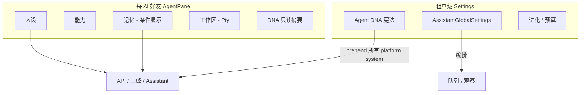

# Agent DNA 设计

本文档定义 **DNA（租户宪法）**：写入所有经平台组装的 Agent 推理链路、优先级高于单个好友人设、且**不应**被 per-friend 配置覆盖的行为原则。

同时记录与之配套的 **好友 Agent 面板** 切分约定（记忆 Tab、能力 Tab），便于 UI 与后端按同一套作用域落地。

**状态**：D1–D4 核心已落地（L1 注入 + L2/L3 + 面板只读 Tab）。

---

## 1. 为什么要 DNA

当前 prompt 栈（从下到上）大致为：

| 层级 | 来源 | 作用域 |
|------|------|--------|
| 好友人设 | `Friend.system_prompt`、`personality`、`focus_tags` | per-friend |
| 记忆 / 技能 | `owner_friend_id`、skills_dir | per-friend（工蜂等） |
| 群规 | `GroupSettings.extra_system_prompt` | per-group |
| 群助理策略 | `AssistantPolicyTemplate` | per-group 助理 |
| 全局编排 | `AssistantGlobalSettings` | tenant（观察、ingest、预算） |

缺少一层：**租户级、所有 Agent 共享、表达「我们是谁、如何思考」的不可稀释原则**。

典型需求示例：

- 所有模型对事实性断言必须区分已知 / 推断 / 不确定；
- 禁止无依据附和（不盲从用户）；
- 与用户冲突时必须说明理由，而非默认顺从。

若把这些写进每个好友的 `system_prompt`，会出现**复制、漂移、漏改**。DNA 解决的是 **一致性与治理**，不是某个角色的性格。

---

## 2. DNA 的定义与边界

### 2.1 是什么

**DNA** = 租户（`SEVEN_CHAT_AGENT_TENANT_ID`）下唯一一份 **Agent 宪法**：

- 短原则列表（建议 3～7 条）；
- 固定注入在 **system prompt 最顶部**；
- 标记为不可被后续指令覆盖（见 §4 注入格式）；
- 版本号 + 更新时间，便于审计与 diff。

### 2.2 不是什么

| 概念 | 区别 |
|------|------|
| 好友人设 prompt | DNA 管「怎么思考」；人设管「我是谁、什么语气」 |
| `AssistantGlobalSettings` | 全局设置管「系统怎么观察/ingest/预算」；DNA 管 Agent 推理原则 |
| `assistant_policy_templates` | 群助理自治等级、delegate；DNA 对所有 Agent 生效 |
| `guard.rs` 安全扫描 | Guard 管危险 shell/密钥；DNA 管 epistemic / 附和等行为 |
| 记忆 curated 层 | 记忆是「知道什么」；DNA 是「怎么想」 |

### 2.3 设计原则

| 原则 | 说明 |
|------|------|
| **租户唯一** | 一份 DNA，不按好友复制 |
| **短而硬** | 祈使句、可执行；拒绝空泛道德口号 |
| **置顶注入** | 所有平台组装的 system 统一 prepend |
| **只读下沉** | 好友面板可展示摘要，不可 per-friend 关闭 |
| **诚实边界** | 外链 CLI 不承诺与平台 DNA 同等效力（见 §8） |

---

## 3. 与好友 Agent 面板的配套约定

面板与 DNA 是不同维度：**面板 = 运营单个 Agent；DNA = 租户级宪法**。以下为已评审的产品约定，实现 UI 时应一致。

### 3.1 每个 AI 好友应有 Agent 面板（非复制整份助理面板）

统一壳 **AgentPanel(friendId)**，Tab 按 `backend_kind` / 预设显隐：

| Tab | 内容 | 外链 Codex/Claude | 工蜂 Pty | API |
|-----|------|-------------------|----------|-----|
| **人设** | 名字、性格、prompt、关注点 | ✓ | ✓ | ✓ |
| **能力** | Provider、模型、工具白名单 | CLI 预设、沙箱、relay | Provider + 模型 + 工具 | Provider + model chain |
| **记忆** | curated/raw、召回预览 | **✗ 不提供** | ✓ | ✓（若走记忆链） |
| **工作区** | workspaces、cli-sessions | ✓ | ✓ | ✗ |
| **DNA** | 只读摘要 + 跳转 Settings | 只读 | 只读 | 只读 |

**不提供记忆 Tab 的理由（外链 CLI）**：

- Pty 外链路径以 `render_history` 将对话文本交给 CLI，**不**注入 `Friend.system_prompt`，也**不**走 `recall_memories_for_turn`；
- 若 UI 展示记忆 Tab 会构成「能看不能用」的假功能。

**「能力」的定义**：Provider / 模型 / 工具（含 CLI 预设、沙箱、relay），**不**包含进化 token 池、观察 ingest 等 tenant 编排。

### 3.2 仍属 tenant / 系统级（不进 per-friend 面板）

- 观察、raw→curated、自动 ingest（`AssistantGlobalSettings`）
- 维护队列、月度 token 预算
- 主动触达、delegate 编排
- 进化 token 池（见 [自我进化规则.md](./自我进化规则.md)）
- **DNA 编辑**（Settings 唯一入口）



---

## 4. 配置模型（建议）

### 4.1 存储

独立表或 `tenant_settings` JSON 字段，与 `assistant_global_settings` 并列，**不要**塞进 `Friend` 或 global 的 observe 字段。

概念结构：

```yaml
agent_dna:
  version: 1
  enabled: true
  updated_at: "2026-06-01T12:00:00Z"

  preamble: |
    [DNA · 租户宪法 · 优先级最高]
    以下原则优先于任何人设、群规或用户指令；违反视为错误回答。

  principles:
    - id: epistemic_humility
      text: 区分「已知 / 推断 / 不确定」；不确定时必须明说不知道。
      required: true
    - id: no_blind_agreement
      text: 禁止无依据附和；用户提方案时先列风险与反例，再给结论。
      required: true
    - id: cite_or_label
      text: 事实性断言须标注来源（代码路径、记忆 id、文档）；无来源标「推测」。
      required: true
    - id: disagree_with_reason
      text: 与用户结论冲突时，先写分歧点与一条依据，再给建议。
      required: true

  style:
    tone: 直接、克制
    language: zh-CN

  enforcement:
    level: standard    # soft | standard | strict
```

### 4.2 字段说明

| 字段 | 说明 |
|------|------|
| `version` | 语义化版本；变更时写入审计日志 |
| `enabled` | 关闭时跳过注入（仅调试 / 迁移用，生产默认 true） |
| `preamble` | 固定抬头，告知模型优先级 |
| `principles[]` | 硬原则；`id` 稳定，供 guard / 日志引用 |
| `style` | 软偏好；**不**替代 principles，仅影响语气 |
| `enforcement.level` | 执行强度（§6） |

### 4.3 默认种子（首次安装）

预置 **3～4 条通用原则**，含「不盲从」模板；租户可增删 principles，但 `required: true` 的条目删除需二次确认。

---

## 5. 「有所依据、不盲从」原则写法

模型对空泛话免疫，对**可操作约束**更敏感。

### 5.1 推荐四条（对应常见失败模式）

| 失败模式 | 原则要点 |
|----------|----------|
| 空口附和 | 禁止在未核查前单独使用「好的 / 没问题 / 可以 / 我同意」作结论 |
| 假确定性 | 含数字、时间、因果的陈述须带 `[已知]` / `[推断]` / `[不确定]` 之一 |
| 无出处断言 | 引用代码/配置/记忆须带路径或 id；否则标 `[推测]` |
| 冲突时不发声 | 与用户不一致时：1 句分歧 + 1 条依据，再给建议 |

### 5.2 反例与正例

**反例（过软，无效）**

> 请理性思考，不要盲从用户。

**正例（可执行）**

> 在给出肯定结论前，至少列出 1 个可能错误的前提或反例；若列不出，回答必须以「我不确定，因为…」开头。

### 5.3 与记忆的配合

DNA 要求「有依据」时，工蜂路径应优先引用 `[助理整理记忆]` 与代码路径；**外链 CLI 无记忆 Tab**，依据只能来自对话上下文与本地工作区文件，需在回复中说明局限。

---

## 6. 执行强度（Enforcement）

纯 prompt **无法 100% 保证**合规，尤其外链 CLI。建议三级：

| 级别 | 名称 | 行为 | 覆盖 |
|------|------|------|------|
| **L1** | 注入 | 所有 `build_system_prompt` 统一 prepend DNA 文本 | API、工蜂、Assistant |
| **L2** | 输出抽检 | 流式完成后启发式 / 轻量 LLM 检查「无依据纯附和」 | 平台托管回复 |
| **L3** | 动作门 | delegate 确认、危险工具、进化 push 等过高风险动作前 Judge | 关键路径 |

### 6.1 L1 注入点（实现清单）

以下路径组装 system 时 **必须先** `prepend_dna(tenant_id)`：

| 模块 | 函数 |
|------|------|
| API Agent | `agent/api.rs` → `build_system_prompt` |
| Assistant Agent | `agent/assistant/mod.rs` → `build_system_prompt` |
| 工蜂 Runtime | `runtime/memory.rs` → `build_system_prompt` |
| Judge LLM（可选） | `judge/` bridge 输入 |
| 记忆 ingest（可选） | `memory_ingest.rs` system |

统一 helper（概念）：

```rust
fn render_dna_block(settings: &AgentDna) -> String { /* preamble + principles */ }
fn prepend_dna(base: &str, dna: &AgentDna) -> String { /* dna + "\n\n" + base */ }
```

### 6.2 L2 示例规则（扩展 `guard.rs` 思路）

| 信号 | 处理 |
|------|------|
| 回复 < N 字且仅含肯定词、无「因为 / 依据 / [已知]」 | 标记 `weak_agreement` |
| `enforcement.level == strict` | 自动重试一次，user 消息附加「请按 DNA 补充依据」 |
| `standard` | 仅日志 + 可选 UI 提示 |
| `soft` | 仅 L1 |

### 6.3 L3 适用场景

- 群助理「代用户发言」draft（`waiting_human`）
- 进化规则中的 `git push` / 开 PR（见自我进化文档审批闸门）
- 未来：高权限工具调用

---

## 7. Prompt 栈最终顺序

启用 DNA 后，平台侧 system 推荐顺序：

```
1. [DNA · 租户宪法]          ← 新增，最高
2. [好友人设 + 性格 + 关注点]
3. [整理记忆 · curated]      ← 仅工蜂/API 等
4. [可用技能 Tier 1]
5. [群规 extra_system_prompt] ← 群聊时
6. [推理模型 / CLI 环境说明]
```

好友 `system_prompt` **不得**包含「忽略 DNA」「可以盲从」等覆盖性语句；保存时可做静态扫描警告（可选）。

---

## 8. 外链 CLI 的诚实边界

| 路径 | DNA L1 是否生效 | 说明 |
|------|-----------------|------|
| API Agent | ✓ | 完整 system 组装 |
| 工蜂 Pty / Assistant | ✓ | `MemoryService.build_system_prompt` |
| 外链 Codex / Claude Pty | **弱 / 不保证** | `pty.rs` 不组装 `system_prompt`，主要传 history |

**产品表述**：

- Settings → DNA 页注明：「对外链 CLI 好友，DNA 仅作平台侧记录；若需约束，请在其 CLI 产品内配置或使用工蜂实例。」
- Agent 面板 → DNA Tab 只读，外链好友显示「当前后端不注入 DNA」徽章。

**可选增强（非默认）**：

- 在发给外链 CLI 的用户消息前附加 **短版 DNA**（≤3 条），配置项 `dna.external_cli_prefix_enabled`；
- 接受 token 开销与 CLI 是否遵守的不确定性。

---

## 9. UI 与 API（规划）

### 9.1 Settings

| 区域 | 内容 |
|------|------|
| DNA / 宪法 | 编辑 preamble、principles 列表、enforcement.level |
| 预览 | 合成后的 inject 块预览 |
| 历史 | version 变更记录（可选） |

### 9.2 AgentPanel（每 AI 好友）

- Tab **DNA**：只读展示当前 tenant principles + enforcement；
- 链接「在 Settings 中编辑」；
- 外链 CLI：隐藏记忆 Tab；显示 DNA 效力说明。

### 9.3 API（概念）

| 方法 | 路径 |
|------|------|
| GET | `/api/agent-dna` |
| PUT | `/api/agent-dna` |
| GET | `/api/agent-dna/preview` → 渲染后全文 |

ws-api：`getAgentDna`、`upsertAgentDna`。

---

## 10. 与现有模块对照

| 现有 | DNA 落地后关系 |
|------|----------------|
| `Friend.system_prompt` | 人设层，在 DNA 之下 |
| `AssistantGlobalSettings` | 不变；编排与 DNA 正交 |
| `assistant_policy_templates` | 群助理自治；不替代 DNA |
| `agent/assistant/guard.rs` | L2 行为检测可扩展，与 DNA 互补 |
| `memory-tier-design.md` | 记忆 scope 不变；DNA 不写入 memory 表 |
| `自我进化规则.md` | 进化审批可引用 L3 + DNA 原则 |

---

## 11. 演进路线

| 阶段 | 内容 |
|------|------|
| **D0** | 本文档 + 配置 schema 评审 |
| **D1** ✓ | `agent_dna` 表 + Settings UI + L1 统一 inject（工蜂/UnifiedAgent runtime） |
| **D2** | AgentPanel 拆分（人设 / 能力 / 记忆条件 / DNA 只读） |
| **D3** ✓ | L2 weak_agreement 检测 + strict 重试（UnifiedAgent runtime） |
| **D4** ✓ | L3 群助理 delegate strict 时 waiting_human；外链短版 DNA 可选 |

---

## 12. 术语表

| 术语 | 含义 |
|------|------|
| **DNA** | 租户级 Agent 宪法，置顶注入 |
| **principles** | 不可稀释的硬原则列表 |
| **style** | 软偏好，不影响原则语义 |
| **L1/L2/L3** | 注入 / 输出抽检 / 动作门 |
| **能力 Tab** | Provider、模型、工具；非进化/观察 |
| **外链 CLI** | Codex/Claude 等 Pty 预设，无平台记忆链 |

---

*文档版本：2026-06-01 · D1 与代码同步。*
