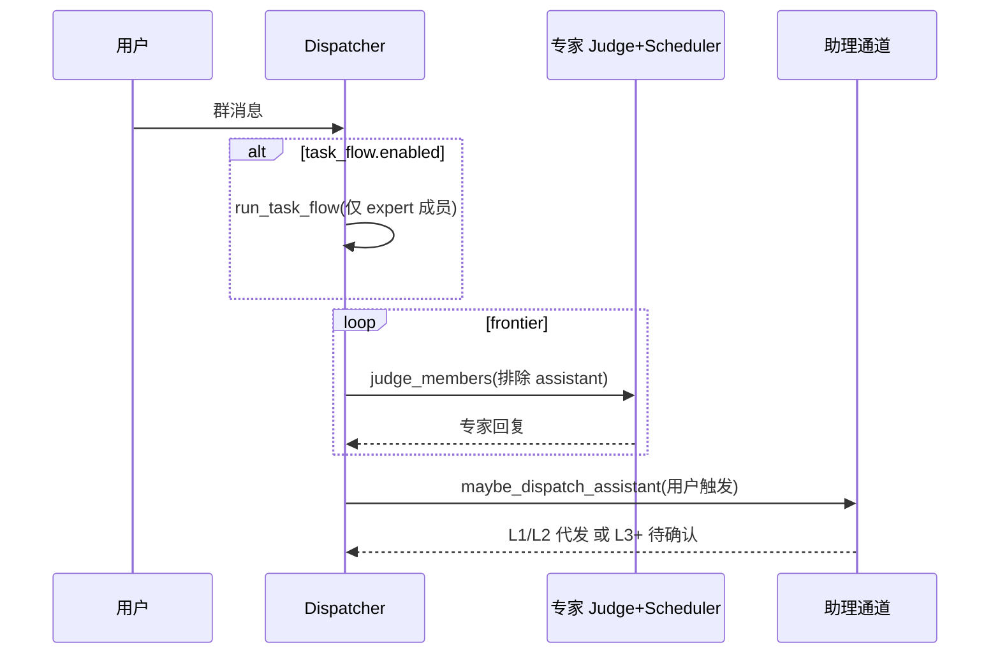

# 群聊助理（Delegate）设计

## 1. 定位

群聊内置 **Hex 助理** 是**用户代理人（delegate）**，不是与 Codex/Claude 等专家抢话的普通成员。

| 维度 | 专家好友 | 群助理 |
|------|----------|--------|
| 角色 | 领域能力、接话讨论 | 代用户小事、大事上报 |
| 调度 | Judge + Scheduler 抢答 | 独立 `assistant_evaluate`，不进抢答池 |
| 默认策略 | — | **delegate**（代发并标注「代你」） |
| 成员 role | `member` | `assistant` |

> 新默认：助理不仅在群聊可见，还会默认观察用户与好友的私聊消息，用于后续记录、整理与知识沉淀。

## 2. 自治等级（Autonomy L0–L4）

| 等级 | 含义 | delegate 默认行为 |
|------|------|-------------------|
| L0 | 仅观察 | 不代发（`observe` 模式） |
| L1 | 轻量代答 | 可直接代发，`on_behalf_of_user=true` |
| L2 | 小决策 | 默认可代发；群 `max_autonomy` 默认 L2 |
| L3 | 须确认 | 发 `waiting_human` 草稿，不标代发 |
| L4 | 禁止代决 | 仅提示用户自行处理 |

分类实现：`heuristic` | `auto`（LLM 失败回退启发式）| `llm`；Provider 默认 `SEVEN_CHAT_AGENT_ASSISTANT_*` 或群内 `classifier_provider_id` / `classifier_model`。

## 3. 数据模型

### 3.1 稳定内置助理

- 常量 `builtin-hex-assistant`：新 seed 使用该 id。
- 旧库：取 `is_builtin=1` 且最早创建的 Hex 助理 id。

### 3.2 `group_members.role`

- `member`：专家（参与 Judge / 任务流）
- `assistant`：群助理（不参与 Judge）
- `muted`：静音（不参与调度）

### 3.3 `GroupSettings.assistant`

```json
{
  "enabled": true,
  "mode": "delegate",
  "max_autonomy": "l2",
  "reply_after_experts": true
}
```

- `mode`: `delegate` | `observe` | `moderate`（moderate：仅 @助理 时介入）
- 默认：`enabled=true`, `mode=delegate`, `max_autonomy=l2`

### 3.4 `messages.on_behalf_of`

- `INTEGER` 0/1：助理代用户发言时为 1，前端展示「助理 · 代你」。

## 4. 调度流程



规则：

1. 专家列表 = `role=member` 且 enabled 的好友。
2. 助理**永不**进入 `judge_members` / 任务流竞选。
3. 用户消息后，若 `assistant.enabled` 且 `mode=delegate`，在 `reply_after_experts` 时于专家轮次结束后执行助理通道。
4. `@助理` / `Hex` / `助理` 可强制触发（即使专家未发言）。

## 5. API

`GroupBundle` 扩展：

- `assistant_member_id: string | null`
- `expert_member_ids: string[]`
- `members[].role`
- 兼容保留 `member_ids`（非 muted 全员）

## 6. 前端

- **GroupEditor**：助理固定展示（builtin），专家多选；助理策略 delegate/observe/moderate、max_autonomy。
- **MessageBubble**：`on_behalf_of_user` → 角标「代你」；`waiting_human` → 「待你确认」+ **采纳代发 / 不采纳** 按钮。

## 6.1 确认代发 API（P1）

`POST /api/conversations/:conv_id/messages/:msg_id/delegate`

```json
{ "approve": true, "content": "可选覆盖正文" }
```

- `approve=true`：状态 → `done`，`on_behalf_of=1`，去掉「【待你确认】」前缀。
- `approve=false`：状态 → `done`，`on_behalf_of=0`，追加「（用户未采纳此建议）」。

## 7. 迁移与分阶段

| 阶段 | 内容 |
|------|------|
| P0 | 角色、设置、分流、delegate 启发式、API、基础 UI |
| P1（已实现） | `POST .../delegate` 采纳/驳回；moderate 模式 UI；群回合 `group_turn` 记忆写入 |
| P2（已实现） | LLM/Auto 自治分类；`assistant_policy_templates` 表与预设；群内 `template_id` 合并生效 |
| P3（已实现） | Webhook 出站 + `/groups/:id/im/inbound` 入站（代发/待确认/用户发言） |

启动迁移：`migrate_ensure_group_assistants` 为既有群插入 `role=assistant` 成员。

## 8. 策略模板 API（P2）

- `GET /api/assistant-policy-templates` — 列表（内置 `preset-delegate` / `preset-strict` / `preset-observe` / `preset-moderate`）
- `POST /api/assistant-policy-templates` — 创建/更新自定义模板
- `DELETE /api/assistant-policy-templates/:id`

群内 `settings.assistant.template_id` 引用模板；保存时内联字段覆盖模板同名字段。`GroupBundle.assistant_resolved` 为调度用的合并结果。

## 9. 外部 IM 回写（P3）

### 9.1 出站 Webhook

`settings.assistant.im_writeback`：

| 字段 | 说明 |
|------|------|
| `enabled` | 开启后助理代发/待确认等事件 POST 到 `webhook_url` |
| `webhook_url` | 外部机器人接收地址 |
| `inbound_secret` | 入站校验密钥 |
| `notify_delegate` / `notify_waiting_human` | 过滤事件类型 |

出站 JSON 示例：

```json
{
  "event": "assistant_waiting_human",
  "group_id": "...",
  "group_name": "...",
  "conversation_id": "...",
  "message": { },
  "inbound_hint": {
    "path": "/api/groups/{id}/im/inbound",
    "header": "X-SevenChatAgent-Im-Secret",
    "actions": [{ "action": "approve_delegate", "label": "采纳代发" }]
  }
}
```

### 9.2 入站 API

`POST /api/groups/:group_id/im/inbound`

- 请求头：`X-SevenChatAgent-Im-Secret: <inbound_secret>`
- Body：

```json
{ "action": "user_message", "content": "用户从 IM 发来的话" }
{ "action": "approve_delegate", "message_id": "...", "content": "可选覆盖正文" }
{ "action": "reject_delegate", "message_id": "..." }
```

## 10. 助理 Prompt 要点

- 身份：用户代理人，非技术专家抢话。
- 小事：简洁代用户表态，勿越权承诺。
- 大事：输出「【待你确认】」+ 选项，等待用户。
- 注明：代发时语气用「我这边理解是…」而非替用户做不可逆决定。

## 11. 全局策略 API

- `GET /api/assistant/global-settings` — 读取内置助理全局策略
- `POST /api/assistant/global-settings` — 保存（观察范围、记录粒度、整理频率、进化开关、CLI 白名单）
- `POST /api/assistant/global-settings/consolidate` — 手动触发记忆整理

前端：助理面板 → **策略** 标签页。

| 字段 | 说明 |
|------|------|
| `observe_enabled` | 总开关 |
| `observe_dm` / `observe_group` | 私聊 / 群聊观察 |
| `record_max_chars` | 观察记忆截断长度 |
| `record_weight` | 观察记忆权重 |
| `auto_consolidate` / `consolidate_every_n` | 周期性整理 |
| `evolution_enabled` | 回合后反思 → 知识库 |
| `auto_extract_memories` | 回合后提取长期记忆 |
| `tool_whitelist` | CLI 预设白名单（空=不限制） |

## 12. CLI 固化流程（常用）

建议把常用流程沉淀为固定命令，配合 `worker-bee` 执行：

1. **会话观察汇总**
   - 目标：快速拉取助理在私聊/群聊的观察记忆。
   - 约定：按 `kind=conversation_observe` 过滤，输出最近 N 条作为每日简报输入。
2. **待确认代发处理**
   - 目标：批量处理 `waiting_human` 草稿。
   - 约定：先列出待确认消息，再调用 `POST /api/conversations/:conv_id/messages/:msg_id/delegate` 采纳或驳回。
3. **技能库刷新**
   - 目标：把高频流程固化到工具箱。
   - 约定：更新 `data/skills/<assistant_id>/SKILL.md` 后触发重新加载（或重启服务）。
4. **记忆整理**
   - 目标：周期性去重、衰减、清理低价值记忆。
   - 约定：调用 `consolidate_memories(<assistant_id>)` 作为日常维护任务。
