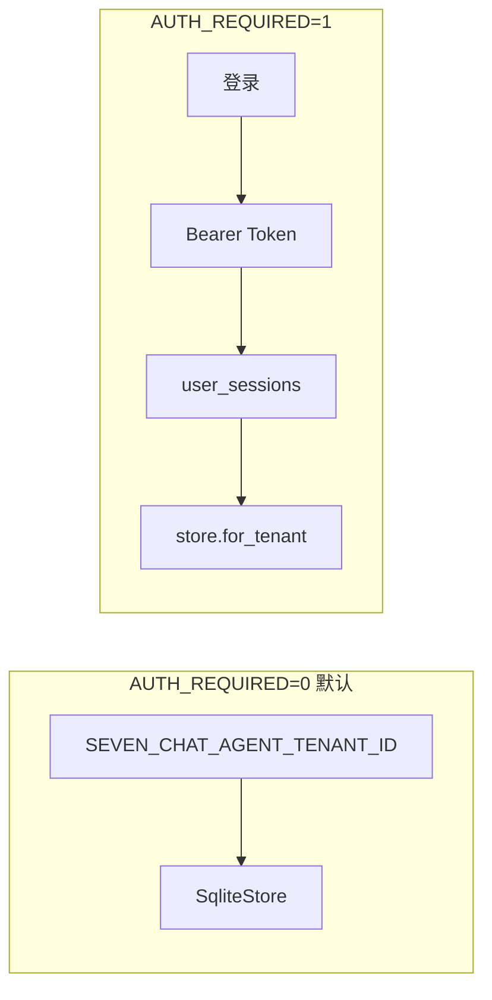
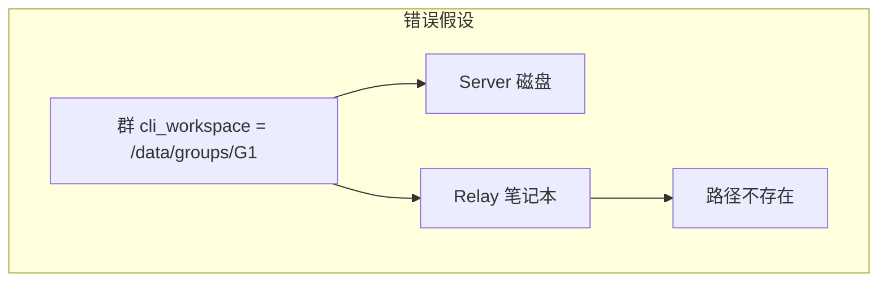

# 多租户与用户体系

本文档完善 **多租户架构**、**用户注册登录**，以及 **群工作区在远程 CLI 场景下的冲突与解法**。与 [工作区与多租户设计](./workspace-multi-tenant-design.md)、[CLI 远程转发架构](./cli-relay-architecture.md)、[Agent DNA 设计](./Agent-DNA设计.md) 配套。

**状态**：T1–T4 已实现；群逻辑工作区 + relay 群 cwd 修复已落地。

---

## 1. 多租户目标与现状

### 1.1 目标形态

| 层级 | 含义 |
|------|------|
| **Tenant** | 组织/团队/个人空间；数据与配额边界 |
| **User** | 租户内账号；登录、角色 |
| **Friend / Group** | 租户内 Agent 与群；不可跨 tenant 引用 |
| **Workspace** | 绑定 `tenant_id` + `owner_friend_id`；登录后另加 `owner_user_id` 按用户隔离（✓ Phase D） |

### 1.2 已实现 vs 待做

| 能力 | 状态 |
|------|------|
| `tenants` 表 + `SEVEN_CHAT_AGENT_TENANT_ID` 进程默认 tenant | ✓ |
| 记忆 / 工作区 / cli_sessions / 全局策略按 tenant | ✓ |
| `users` / `user_sessions` 注册登录 | ✓ T1 |
| `friends` / `groups` / `conversations.tenant_id` | ✓ T1 列 + 写入 |
| 全 API 强制 session tenant（替代 env） | 部分（`AUTH_REQUIRED` 开关） |
| providers / provider_keys 按 tenant | ✓ T3 |
| HTTP routes + attachments tenant 化 | ✓ T3 |
| ws-api tenant 化 | ✓ T3 |
| dispatcher 按会话 tenant 调度 | ✓ T3 |
| 助理队列 `assistant_queue_jobs.tenant_id` | ✓ T3 |
| 租户管理 UI、邀请入租户 | ✓ T4 |
| AgentRegistry 按 tenant 缓存 | ✓ T4 |
| Agent DNA L1 注入 + Settings UI | ✓ T5 |
| 进化 token 池 per-tenant | ✓ T5 |
| 工作区按登录用户隔离（`user_workspace_prefs`） | ✓ Phase D |
| 私聊会话按用户拆分（`conversations.scope_user_id`） | ✓ Phase E |

### 1.3 运行模式

- **`SEVEN_CHAT_AGENT_AUTH_REQUIRED`**：release 构建默认强制登录；debug 构建默认关闭（与改造前一致）。开发时可设 `=0` 关闭。

---

## 2. 用户注册与登录

### 2.1 数据模型

**users**

| 字段 | 说明 |
|------|------|
| `id` | UUID |
| `tenant_id` | 所属租户 |
| `email` | 租户内唯一 |
| `username` | 租户内唯一；注册必填 |
| `password_hash` | Argon2id |
| `display_name` | 显示名 |
| `role` | `admin` \| `member` |

**user_sessions**

| 字段 | 说明 |
|------|------|
| `token_hash` | SHA-256(明文 token)，不明文存库 |
| `expires_at` | 默认 30 天（`SEVEN_CHAT_AGENT_SESSION_TTL_DAYS`） |

**tenants.slug**

- 注册时可指定 `tenant_slug`（小写字母数字连字符）；
- 租户不存在则自动创建；
- 省略时注册到 `default` 租户。

### 2.2 API

| 方法 | 路径 | 说明 |
|------|------|------|
| POST | `/api/auth/register` | `{ email, username, password, display_name, tenant_slug?, invite_code? }` |
| POST | `/api/auth/login` | `{ login, password, tenant_slug? }`（`login` 为邮箱或用户名；兼容旧字段 `email`） |
| POST | `/api/auth/logout` | 需 Bearer；吊销 session |
| GET | `/api/auth/me` | 需 Bearer；当前用户 + tenant |
| GET | `/api/auth/invite/:code` | 预览租户邀请（无需登录） |

响应含 `token`（仅登录/注册返回一次明文）、`user`、`tenant_id`。

**租户管理（需登录，admin 写操作）**

| 方法 | 路径 | 说明 |
|------|------|------|
| GET | `/api/tenant/members` | 列出当前租户成员 |
| PATCH | `/api/tenant/members/:user_id/role` | 调整成员角色 `{ role }` |
| GET | `/api/tenant/invites` | 列出邀请（admin） |
| POST | `/api/tenant/invites` | 创建邀请 `{ invited_email?, role?, expires_in_hours? }` |
| DELETE | `/api/tenant/invites/:id` | 删除未使用邀请（admin） |

ws-api：`register`（含 `invite_code`）、`previewTenantInvite`、`listTenantMembers`、`listTenantInvites`、`createTenantInvite`、`deleteTenantInvite`、`updateTenantMemberRole`。

### 2.3 安全约定

- 密码最少 8 位；
- 注册时可传 **`invite_code`**（或访问 `/?invite=CODE`）；有效邀请码加入指定租户并按邀请角色注册；
- 首个**无邀请**注册到某 tenant slug 的用户为 `admin`；
- 生产务必 `AUTH_REQUIRED=1` + HTTPS；
- 与 **human 邀请码**（`/human/:code`）并存：真人访客不走 users 表，仍用 invite token。

### 2.4 前端流程

1. 未登录且 `AUTH_REQUIRED` → 展示登录/注册页；
2. token 存 `localStorage`（`seven_chat_agent_token`）；
3. `fetch` / ws-api 带 `Authorization: Bearer …`；
4. WebSocket `/ws-api?token=` 可选 query（与 Header 二选一）。

---

## 3. 群工作区问题：远程 CLI 无法共用同一路径

### 3.1 问题本质

当前群聊执行目录解析（`resolve_cli_workspace`）逻辑：

1. 若 `GroupSettings.cli_workspace` 非空 → 在 **服务端** `ensure_at` 该路径；
2. 否则 → `{data}/cli-workspaces/groups/{group_id}`（仍在服务端磁盘）。

当群内 Agent 使用 **cli-relay** 在远程笔记本执行时：

- `run_job.cwd` 是服务端解析出的绝对路径；
- 远程机器上 **不存在** 该路径 → CLI 失败或误在错误目录执行；
- 多个 relay 节点路径各异，**不可能** 共用一个服务端 filesystem 路径作为「群项目目录」。

这是 **执行位置与配置位置错位**，不是简单 bug。

### 3.2 设计原则

| 原则 | 说明 |
|------|------|
| **逻辑项目 ≠ 物理路径** | 群共享「项目身份」（Git URL、issue、文档），不共享单一 cwd |
| **执行 cwd 跟执行者走** | relay 用远程 cwd；local 用服务端 cwd |
| **成员可各异** | 同群不同 Agent 可绑定不同 relay / 不同本地 clone |
| **协调靠 Git** | 多机协作以 remote repo 为真相源，与 [自我进化规则](./自我进化规则.md) 一致 |

### 3.3 解法分层（推荐组合）

#### 方案 A：Runtime 修复（T1 已做）

**规则**：若好友 `execution_mode=relay`，群聊 **忽略** `GroupSettings.cli_workspace` 与服务端 `groups/{id}`，回退到 **该好友私聊工作区解析**（`active_workspace` / `cfg.cwd` / `cli-workspaces/{friend_id}`）。

- 远程 relay 收到的 `cwd` 应对应 **该节点上** 的真实目录（用户在好友工作区里配置远程路径）。
- 群「共享」体现在对话与记忆，而非强制同一文件夹。

#### 方案 B：群逻辑工作区（Phase T2 数据模型）

新增 **`group_workspaces`**（概念）：

| 字段 | 说明 |
|------|------|
| `id`, `group_id`, `tenant_id` | |
| `name` | 如「主仓库」 |
| `kind` | `git` \| `logical` |
| `git_url`, `default_branch` | `kind=git` 时 |
| `logical_key` | 稳定标识，写入 message/memory metadata |

**`group_member_bindings`**（扩展 `GroupMemberConfig`）：

| 字段 | 说明 |
|------|------|
| `friend_id`, `group_workspace_id` | |
| `execution_mode` | `local` \| `relay` |
| `relay_id` | |
| `local_path` | 该成员机器上的 cwd（relay 节点本地路径） |

群消息带 `group_workspace_id`；各 Agent 在自己 `local_path` 执行，但对用户呈现为同一「项目」。

#### 方案 C：Git 同步工作流（产品层）

1. 群设置 `git_url`；
2. 每个 relay 节点文档化：`git clone` 到固定路径，好友工作区指向该路径；
3. 执行前可选 `git pull`（relay 端实现，待做）；
4. 变更通过 PR/push 对齐，而非 NFS 共享文件夹。

#### 方案 D：仅 API/工蜂成员参与「群项目 cwd」

群 `cli_workspace` **仅对 local Pty** 生效；relay 成员自动走方案 A；API 成员不使用 cwd。

UI 提示：「群内 N 个远程 CLI 成员不使用群目录，请在各自工作区配置本地 clone 路径。」

### 3.4 UI 建议（GroupEditor）

| 设置 | 说明 |
|------|------|
| 群 Git 仓库 URL | 逻辑项目（可选） |
| 群服务端工作区 | 仅 **local** 成员使用 |
| 成员列表 | 显示 execution_mode / relay；远程标记 🛰 |

### 3.5 记忆与消息

- `messages.workspace_id` / `memories.workspace_id` 继续 per-friend；
- 群级 recall 可增加 `group_workspace_id` 或 `logical_key` 过滤（T2）；
- 避免假设「全群同一 cwd」才能召回记忆。

---

## 4. 租户隔离路线图

| 阶段 | 内容 |
|------|------|
| **T1** ✓ | users/sessions；friends/groups/conversations.tenant_id；auth API；relay 群 cwd 修复 |
| **T2** ✓ | group_workspaces + member_bindings；GroupEditor UI；runtime 绑定 cwd |
| **T3** ✓ | providers/provider_keys 按 tenant；dispatcher 按会话 tenant；ws-api + HTTP routes tenant 化；助理队列多 tenant |
| **T4** ✓ | 租户邀请、成员 RBAC、AgentRegistry tenant 缓存、团队管理 UI |
| **T5** ✓ | Agent DNA（L1 注入 + 设置 UI）；进化 token 预算 per-tenant |
| **T6** ✓ | FriendEditor Agent 面板 Tab 拆分；DNA L2/L3；release 默认 AUTH_REQUIRED |

---

## 5. 环境变量

| 变量 | 默认 | 说明 |
|------|------|------|
| `SEVEN_CHAT_AGENT_TENANT_ID` | `default` | 无 auth 时的 tenant |
| `SEVEN_CHAT_AGENT_AUTH_REQUIRED` | release 默认 `1`；debug 默认 `0` | 显式 `0` 关闭强制登录 |
| `SEVEN_CHAT_AGENT_SESSION_TTL_DAYS` | `30` | 会话有效期 |

---

## 6. 术语

| 术语 | 含义 |
|------|------|
| **Tenant** | 数据隔离边界 |
| **逻辑工作区** | Git URL / logical_key，无单一 cwd |
| **执行绑定** | 成员在 local/relay 上的实际 cwd |
| **Relay** | 远程本机执行 CLI，cwd 必须在远程存在 |

---

*文档版本：2026-06-01 · T1–T6 与代码同步。*
