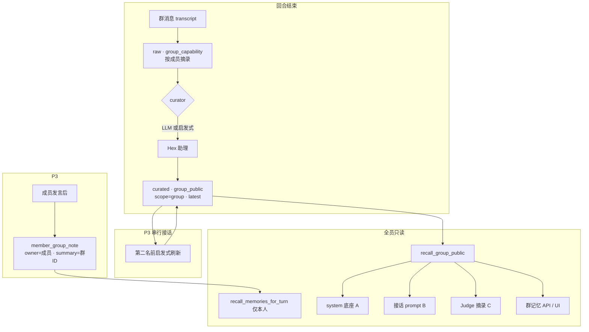

# 群公共记忆与提示词整合开发计划

依据群聊讨论结论：**群场面共识由单一 curator 整理为公域记忆**；成员可选自述层；**全员只读共享**，通过统一 recall 管道注入各自 system / 接话 / Judge 提示词。

**关联文档**：[群成员画像与协作调度开发计划](./群成员画像与协作调度开发计划.md)、[群聊助理（Delegate）设计](./group-assistant-design.md)

**现状摘要（2026-06-11 · 已落地）**

| 能力 | 代码位置 | 状态 |
|------|----------|------|
| raw 成员表现摘录 | `profile/capability.rs` | ✅ 回合末写入；超 48 条自动归档 |
| 群共识 curated | `profile/group_memory.rs` | ✅ `group_public` latest UPSERT + LLM/heuristic curator |
| 全员只读 recall | `store/memory.rs` | ✅ `list/search_group_public_memories` |
| A/B 层注入 | `dispatcher.rs` · `runtime/memory.rs` · `agent/api.rs` | ✅ system + 接话 user prompt |
| Judge C 层 | `judge/service.rs` · `seven-chat-agent-judge` | ✅ `group_context_excerpt` |
| 成员自述 | `profile/member_group_note.rs` | ✅ 仅本人 recall，按群 `summary` 过滤 |
| HTTP + 前端 | `server/routes/mod.rs` · `GroupPublicMemoryPanel` | ✅ 查看 / 搜索 / 置顶 / 手动整理 |
| 串行接话刷新 | `refresh_group_public_mid_turn` | ✅ 第二名及以后启发式刷新共识 |

**文档状态**：**P0–P3 已验收**（含 B 层向量召回、`ChatWindow` 跳转群共识）

---

## 1. 目标

| 目标 | 说明 |
|------|------|
| **公域一份** | 每群一份 curated「群共识」记忆，不复制到各成员 owner |
| **全员可读** | 群内心 Agent 接话、Judge、协调者均可只读引用 |
| **可查可调试** | 群设置 / API 可浏览、搜索群公共记忆 |
| **分层写入** | raw 自动摘录 → curator 整理 → curated 公域；成员自述可选 |
| **Token 可控** | system 底座 + 本轮检索分预算，不压过用户原话 |

**非目标（本计划不含）**

- 不做跨群知识图谱或全局成员能力市场
- 不让每个成员各写一份「群真相」公域（避免 N 套叙事）
- ~~B 层向量召回~~（已接 `embedding_enabled`，与 FTS 合并）
- 不替换 Hex 助理私聊记忆体系，仅扩展 `scope=group` 公域

---

## 2. 架构



### 2.1 Curator 规则

| 场景 | 整理者 | 说明 |
|------|--------|------|
| 用户回合末 | Hex 助理（`finalize_group_turn_memory`） | raw + 本轮消息 → latest；可配置 `group_memory_enabled` |
| 串行接话中途 | 启发式 only（`refresh_group_public_mid_turn`） | 无 LLM，降低并行盲区 |
| 手动 | `POST .../public-memories/rebuild` | 管理端触发 LLM curator |
| 写入权限 | **仅 curator** | 专家成员只读 `group_public` curated |

### 2.2 与画像调度边界

- **调度层**仍只读 `routing_hints` / persona；**不**根据记忆内容改调度逻辑。
- **群共识**仅作 prompt 与 Judge 上下文，不作为 MBTI/Agent24 输入。

---

## 3. 数据模型

### 3.1 Memory 字段约定

| 字段 | `group_capability`（raw） | `group_public`（curated） | `member_group_note` |
|------|---------------------------|---------------------------|---------------------|
| `owner_friend_id` | 助理 id | 助理 id | 成员本人 id |
| `scope` | `group` | `group` | `friend` |
| `scope_ref` | 群 id | 群 id | 成员 id |
| `tier` | `raw` | `curated` | `curated` |
| `kind` | `group_capability` | `group_public` | `member_group_note` |
| `title` | 成员 friend_id | `latest` | turn 前缀 |
| `summary` | — | JSON 共识（可选） | **群 id**（召回过滤） |

### 3.2 `group_public` JSON Schema（curator 输出 → `summary` + Markdown `content`）

```json
{
  "facts": ["已确认事实…"],
  "assignments": [{"member": "甲", "task": "…"}],
  "open_questions": ["未决…"],
  "failures": [{"member": "乙", "reason": "发送失败: …"}],
  "updated_at": "ISO8601"
}
```

### 3.3 每群一条 latest

- `title=latest` + `scope_ref=group_id`：**UPSERT** 单条 curated。
- raw 按回合追加；每群保留最近 **48** 条 active，其余 `status=archived`。

---

## 4. 提示词注入规范

### 4.1 三层注入

| 层 | 时机 | 来源 | 预算 | 注入位置 |
|----|------|------|------|----------|
| **A. 共识底座** | `build_system_prompt` | latest + pinned | 400–800 字 | `[本群共识 · 只读]` |
| **B. 话题相关** | `dispatch_expert_round` | FTS + trigger | 300–600 字 | `[与本话题相关的群记忆]` |
| **C. Judge 摘录** | `judge_members` | failures/分工前 3 bullet | ≤200 字 | `JudgeRequest.group_context_excerpt` |

### 4.2 `ChatContext` 扩展

- `group_public_baseline: Option<String>` — 同轮 dispatch 内复用，避免重复查库。

---

## 5. 后端任务与验收

### P0：全员只读 recall + 接话注入 ✅

| 任务 | 模块 | 状态 |
|------|------|------|
| `list_group_public_memories` / `search_group_public_memories` | `store/memory.rs` | ✅ |
| `format_group_public_*` / `fetch_*` | `profile/group_memory.rs` | ✅ |
| 接话 B + system A | `dispatcher.rs` · `runtime/memory.rs` · `agent/api.rs` | ✅ |
| `MEMORY_KIND_GROUP_PUBLIC` | `memory_tier.rs` | ✅ |
| 单测 | `profile/group_memory.rs` | ✅ |

**验收**

- [x] 人工写入 `group_public` 后接话含 `[与本话题相关的群记忆]`（命中时）
- [x] 群聊 system 含 `[本群共识 · 只读]`（有 latest 时）
- [x] 个人 `recall_memories_for_turn` 行为不变（回归单测）
- [x] 协调者 `task_flow` 仍可读 `format_group_capability_excerpt`（回归）

---

### P1：Curator 整理流水线 ✅

| 任务 | 模块 | 状态 |
|------|------|------|
| `upsert_group_public_latest` | `profile/group_memory.rs` | ✅ |
| `curate_group_public_from_turn` | 同上 | ✅ LLM + heuristic 回退 |
| 回合末触发 | `dispatcher.rs` · `finalize_group_turn_memory` | ✅ |
| `orchestration.group_memory_enabled` | `domain.rs` | ✅ 默认 true |
| 失败写入 curator | prompt + heuristic | ✅ `failures[]` |

**验收**

- [x] 回合末自动更新 `group_public` latest（启发式/LLM）
- [x] 共识含失败/分工字段时可被 B/C 层引用
- [x] raw 仍追加，latest 单条 UPSERT

**已做增强**：任务流 `CoordinatorPlan` 后 `merge_coordinator_plan_into_group_public` 即时写 assignments

---

### P2：Judge + API + 前端可查 ✅

| 任务 | 模块 | 状态 |
|------|------|------|
| Judge C 层 | `judge/service.rs` · `heuristic.rs` · `prompt.rs` | ✅ |
| `GET/POST /api/groups/:id/public-memories` | `server/routes/mod.rs` | ✅ |
| 群编辑器共识面板 | `GroupPublicMemoryPanel.tsx` | ✅ |
| 编排事件「群共识已更新」 | `BusEvent::GroupPublicUpdated` · `chat.ts` | ✅ |
| B 层向量检索 | `search_group_public_memories_vector` · `fetch_group_public_relevant` | ✅ FTS + 向量合并（需 `embedding_enabled`） |

**验收**

- [x] 群设置页查看 latest 全文与更新时间
- [x] Judge 共识含失败时更易判定应接话（启发式单测）
- [x] HTTP API 已对齐（ws-api 未单独暴露，走 REST）

---

### P3：成员自述 + 增强 ✅

| 任务 | 状态 |
|------|------|
| `member_group_note` 接话后写入 + 按群 recall | ✅ |
| `PATCH .../public-memories/latest` 置顶 / importance | ✅ |
| raw 超量归档（48 条/群） | ✅ `archive_excess_group_capability_raw` |
| 串行接话前启发式刷新 | ✅ `refresh_group_public_mid_turn` |
| `FriendProfileEditor` 文案区分画像/共识/自述 | ✅ |
| `recall_context_from_chat` 修正 `friend_id=self` | ✅ |

**已做增强**

- [x] ChatWindow「群共识已更新」条 +「查看群共识」→ `GroupEditor` 滚动至共识面板
- [x] `expires_at`：`group_public_ttl_days` + `archive_expired_memories`（维护/回合末）
- [x] 协调者分工后即时合并 assignments（`merge_coordinator_plan_into_group_public`）

---

## 6. API

### 6.1 读取

```
GET /api/groups/{group_id}/public-memories?q=&limit=20&include_raw=1
```

响应：`latest`（含 `pinned` / `importance`）、`raw_recent`、`search_hits`。

### 6.2 写入 / 维护

```
POST /api/groups/{group_id}/public-memories     # 手动 rebuild curator
PATCH /api/groups/{group_id}/public-memories/latest  # { "pinned": true, "importance": 3 }
```

---

## 7. 前端

| 页面 | 状态 | 内容 |
|------|------|------|
| `GroupEditor` | ✅ | 共识面板、搜索 raw、置顶、手动整理、`group_memory_enabled` 开关 |
| `OrchestrationEventLog` | ✅ | `group_public_updated` 事件 |
| `FriendProfileEditor` | ✅ | 画像 vs 群共识 vs 自述说明 |
| `ChatWindow` 跳转 | ✅ | `groupPublicBanner` +「查看群共识」 |

---

## 8. 测试

| 类型 | 用例 | 状态 |
|------|------|------|
| 单测 | `format_group_public_*`、UPSERT、FTS、judge excerpt、member_note 按群隔离 | ✅ |
| 集成 | `profile_store_integration`、dispatcher E2E Stub | ✅ |
| 回归 | `cargo test -p seven-chat-agent-core`（59+ lib tests） | ✅ |

---

## 9. 验收命令

```bash
# 单元 + 模块内集成（含 group_memory / member_group_note）
cargo test -p seven-chat-agent-core

# 画像 / 编排 / Dispatcher E2E
cargo test -p seven-chat-agent-core --test profile_store_integration
cargo test -p seven-chat-agent-core --test dispatcher_orchestration_integration
cargo test -p seven-chat-agent-core --test dispatcher_e2e_integration

# Judge 启发式（含 group_consensus_failure）
cargo test -p seven-chat-agent-judge heuristic

# 前端
cd web && npm run build
```

---

## 10. 与画像计划衔接

- [群成员画像与协作调度开发计划](./群成员画像与协作调度开发计划.md) §9：`group_capability` raw 为 curator 输入；`group_public` 为对外可读产物。
- 协调者任务流：**共识 A 层**（`group_public_baseline`）+ **raw 表现**（`format_group_capability_excerpt`）+ roster 能力 hint；普通专家用 `group_public` A/B 层。
- 画像调度**不**读取 `group_public` 改 routing。

---

## 11. 关键代码索引

| 路径 | 职责 |
|------|------|
| `crates/.../profile/group_memory.rs` | curator、UPSERT、A/B 格式化、finalize / mid-turn |
| `crates/.../profile/member_group_note.rs` | 成员自述写入 |
| `crates/.../profile/capability.rs` | raw 摘录与归档 |
| `crates/.../store/memory.rs` | 群公共 recall SQL、member_note 过滤 |
| `crates/.../dispatcher.rs` | 注入、回合末、串行刷新、BusEvent |
| `crates/seven-chat-agent-judge/src/context.rs` | `group_context_excerpt` |
| `web/src/components/GroupPublicMemoryPanel.tsx` | 群共识 UI |

---

*文档版本：2026-06-11 · 状态：**P0–P3 已验收***
