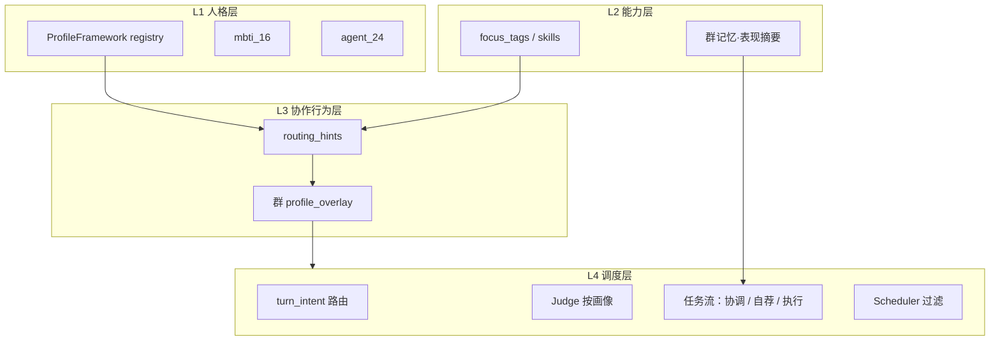

# 群成员画像与协作调度开发计划

依据群聊策略讨论结论：从「群级固定流水线」改为「**成员画像 × 消息类型 → 动态路径**」。人格层可扩展（MBTI 16 + Agent 24），调度层只读协作行为 `routing_hints`。

**关联文档**：[群聊助理（Delegate）设计](./group-assistant-design.md)、[Agent DNA 设计](./Agent-DNA设计.md)

---

## 1. 目标

| 目标 | 说明 |
|------|------|
| **成员差异化** | 主动型广关注、被动型被点名才说话、协调型拆任务并 `@` 分配 |
| **画像可扩展** | 新量表 = 新 Framework 注册条目，不改调度主流程 |
| **群级可覆盖** | 好友全局画像 + 本群 `profile_overlay`，同人在不同群可不同表现 |
| **向后兼容** | 未配置画像的成员沿用现有 Judge/任务流；群级开关保留 |

**非目标（本计划不含）**

- 不做完整心理测评产品；MBTI/24 型为协作原型，非临床量表
- 不替换 Hex 助理代理人通道（见 group-assistant-design）
- 不在 P0～P1 做跨群成员能力知识图谱

---

## 2. 架构分层



**调度器铁律**：`dispatch_group` / `SpeakerScheduler` / `task_flow` **只读** `EffectiveMemberProfile.routing_hints` 与 `prompt_persona_block`，**不**硬编码 MBTI 字母。

---

## 3. 数据模型

### 3.1 `MemberProfile`（好友级，JSON 存 `friends.profile_json`）

```json
{
  "schema_version": 1,
  "frameworks": [
    { "id": "mbti_16", "type_code": "ENTJ", "source": "user_selected", "confidence": 1.0 },
    { "id": "agent_24", "type_code": "策士·主导", "source": "inferred", "confidence": 0.8 }
  ],
  "axes": {
    "extraversion": 0.82,
    "intuition": 0.71,
    "thinking": 0.65,
    "judging": 0.88,
    "initiative": 0.9,
    "coordination": 0.85
  },
  "routing_hints": {
    "initiative": "proactive",
    "coordination": "coordinator",
    "respond_to_mention": true,
    "self_nominate": true,
    "campaign_eligible": true,
    "fallback_pick_eligible": false,
    "peer_vote_eligible": true
  },
  "use_derived_routing": true,
  "extensions": {}
}
```

| 字段 | 说明 |
|------|------|
| `frameworks[]` | 可挂多种量表；`id` 对应 registry |
| `axes` | 连续维度；可由 type 推导或手调 |
| `routing_hints` | 调度唯一行为输入；`use_derived_routing=true` 时保存时从 frameworks 重算 |
| `extensions` | 租户自定义键值，JSON Schema 校验（P2） |

### 3.2 `MemberProfileOverlay`（群成员级，JSON 存 `group_members.profile_overlay`）

仅覆盖与群相关的字段，合并规则：**overlay 优先于 base**。

```json
{
  "routing_hints": { "initiative": "passive" },
  "disabled_frameworks": []
}
```

### 3.3 `EffectiveMemberProfile`（运行时，不落库）

```rust
// 概念
struct EffectiveMemberProfile {
    routing_hints: RoutingHints,
    prompt_persona_block: String,  // 各 framework prompt_snippet 拼接
    capability_tags: Vec<String>,    // focus_tags + 可选记忆摘要
    frameworks: Vec<FrameworkBinding>,
}
```

### 3.4 `RoutingHints` 枚举

| 字段 | 类型 | 默认（balanced） |
|------|------|------------------|
| `initiative` | `proactive` \| `balanced` \| `passive` | `balanced` |
| `coordination` | `coordinator` \| `contributor` \| `none` | `none` |
| `respond_to_mention` | bool | true |
| `self_nominate` | bool | proactive=true |
| `campaign_eligible` | bool | 同 self_nominate |
| `fallback_pick_eligible` | bool | passive=false |
| `peer_vote_eligible` | bool | true |

### 3.5 `ProfileFramework` 注册表

静态 JSON + 可选 DB 自定义（P2），路径建议：

```
data/profile-frameworks/
  mbti_16.json
  agent_24.json
  index.json
```

单条 type 定义示例：

```json
{
  "type_code": "ENTJ",
  "label_zh": "指挥官",
  "axis_defaults": { "extraversion": 0.85, "thinking": 0.8, "judging": 0.9 },
  "default_routing_hints": {
    "initiative": "proactive",
    "coordination": "coordinator",
    "self_nominate": true
  },
  "prompt_snippet": "你倾向结论先行、推动分工与排期…"
}
```

**Agent 24 定义（本计划采用 C：与 MBTI 平行）**

- 24 个职能协作原型（策士、工匠、巡检、主持、文档、攻坚…），每个带独立 `default_routing_hints`
- 可与 MBTI 并存；UI 允许用户选「主展示 framework」
- 详见附录 A（P0 先内置 8 个，P1 补全 24）

---

## 4. 调度行为规格

### 4.1 回合意图 `TurnIntent`（P1）

用户消息入口轻量分类（启发式 + 可选 LLM）：

| Intent | 触发启发式 | 路径 |
|--------|------------|------|
| `chitchat` | 短句、无任务动词 | 低预算 frontier |
| `qa` | 含 `?` / 疑问词 | 派 1～2 相关专家 |
| `task` | 实现/修复/部署等 | 协调 + 自荐 + 执行 |
| `decision` | 选型/是否/对比 | 助理/协调者优先 |
| `status` | 进度/完成了吗 | @ 者或 persisted leader |

### 4.2 Judge 按 `initiative`

| initiative | 用户消息 | 好友消息 | @ 本人 |
|------------|----------|----------|--------|
| proactive | 低阈值，广接话 | 专长/疑问可接 | 必接 |
| balanced | 现有逻辑 | 现有逻辑 | 必接 |
| passive | 默认不接 | 默认不接 | 必接 |

实现：`seven-chat-agent-judge` 新增 `HeuristicJudgeSettings` 成员倍率或独立 `evaluate_with_profile(req, hints)`。

### 4.3 Scheduler

- `fallback_pick_eligible=false` 的成员不参与兜底
- 用户触发每轮上限仍受 `max_replies_per_turn` 约束，但**优先** proactive > balanced > passive

### 4.4 任务流改造（P1）

替换「全员竞选」为：

```
task intent
  → 1. coordinator_plan（coordination=coordinator 的成员，0～1 人；多人取 axes.coordination 最高）
  → 2. proactive_self_nominate（initiative=proactive 且 self_nominate）
  → 3. merge_assignments（协调者 @ + 自荐 + 用户 @ + persisted_leader）
  → 4. execute（仅被分配成员生成；被动成员无分配则跳过）
```

群级 `task_flow.campaign_enabled` 保留：false 时跳过步骤 2，但不跳过步骤 1（若有协调者）。

---

## 5. 阶段与交付

| 阶段 | 名称 | 状态 |
|------|------|------|
| **P0** | 画像 schema + 推导 + Judge/Scheduler 分流 | ✅ 本迭代 |
| **P1** | 回合意图 + 任务流协调/自荐/执行 | ✅ 本迭代（核心路径） |
| **P2** | Framework 注册表 API + 推断 + 能力快照 | ✅ 本迭代 |
| **P3** | 群记忆能力表 + 协调者流程优化建议 | ✅ 本迭代（核心路径） |

---

## 6. P0：画像基础 + Judge 分流

**目标**：配置画像后，闲聊场景已能区分主动/被动；无画像成员行为不变。

### 6.1 后端

| 任务 | 文件/模块 |
|------|-----------|
| 迁移：`friends.profile_json`、`group_members.profile_overlay` | `migrations/` |
| Rust 类型：`MemberProfile`、`RoutingHints`、`MemberProfileOverlay` | `domain.rs` |
| `profile/mod.rs`：merge、derive_routing_hints、build_persona_block | 新模块 `seven-chat-agent-core/src/profile/` |
| 内置 `mbti_16.json`（16 type）+ `agent_24.json`（先 8 type） | `data/profile-frameworks/` |
| Judge：`evaluate` 读 `routing_hints` | `judge/heuristic.rs`、`judge/prompt.rs` |
| Scheduler：过滤 `fallback_pick_eligible` | `scheduler.rs` |
| `dispatch_expert_round` 传入 `EffectiveMemberProfile` | `dispatcher.rs` |
| `GroupBundle` 返回成员 `effective_profile` 摘要 | `store/group.rs`、server routes |

### 6.2 API

| 方法 | 路径 | 说明 |
|------|------|------|
| GET | `/api/profile-frameworks` | 列表 + type catalog |
| GET | `/api/friends/:id/profile` | 读取好友画像 |
| PUT | `/api/friends/:id/profile` | 保存；`use_derived_routing` 时重算 hints |
| POST | `/api/friends/:id/profile/infer` | 从 personality/system_prompt LLM 推断（可选 P0 只做 stub） |

群保存时 `members[].profile_overlay` 随 `UpsertGroup` 写入（扩展现有 API）。

### 6.3 前端

| 任务 | 文件 | 状态 |
|------|------|------|
| 类型定义 | `web/src/types/profile.ts` | ✅ |
| 好友 Agent 面板 · 人设 Tab | `FriendProfileEditor.tsx` | ✅ 全 framework + extensions |
| 群编辑器：成员 overlay | `GroupEditor.tsx` | ✅ 主动/被动 + 协调角色 |

### 6.4 测试

- `profile::derive_routing_hints` 单测：ENTJ → proactive+coordinator
- `heuristic::evaluate` 单测：passive + 用户消息 → should_reply false
- Scheduler 单测：passive 不进入 fallback

### 6.5 验收

- [x] 被动成员在用户寒暄时不接话（无 fallback 拉人）— `heuristic::passive_skips_user_message_without_mention` + `fallback_skips_passive_ineligible`
- [x] 主动成员仍可在专长相关时接话 — 启发式 judge + routing_hints
- [x] 未配置 profile 的群与现网行为一致 — NULL profile → balanced 默认
- [x] 群 overlay 可将全局 proactive 覆盖为 passive — `overlay_passive_overrides_base` 单测

---

## 7. P1：意图路由 + 任务流重构

**目标**：任务型消息走协调→自荐→执行；不再全员竞选。

### 7.1 后端

| 任务 | 模块 |
|------|------|
| `TurnIntent` 分类 | 新 `dispatcher/turn_intent.rs` |
| `dispatch_group` 入口分支 | `dispatcher.rs` |
| `coordinator_plan_phase` | `dispatcher/task_flow.rs` 或 `coordinator.rs` |
| `proactive_self_nominate`（替代全员 campaign 循环） | `task_flow.rs` |
| `merge_task_assignments` | `profile/scheduling.rs` |
| 协调者 prompt：注入成员 roster（name + tags + type_code） | `profile/derive.rs` `build_member_roster` |
| 执行阶段仅调度 assigned member ids | `dispatcher.rs` `filter_task_execute_candidates` |

### 7.2 配置

`GroupSettings` 可选新增（P1）：

```json
{
  "orchestration": {
    "intent_classifier": "heuristic",
    "light_task_flow": true
  }
}
```

- `light_task_flow=true`：task intent 默认跳过 peer_vote / plan_review（可配置保留）

### 7.3 前端

- [x] 群编辑器：orchestration「轻量编排」开关 + 说明
- [x] 群聊事件流：`TurnIntent`、协调分工、自荐摘要、分工合并（TaskFlowPanel）

### 7.4 测试

- [x] 管道集成：`pipeline_task_orchestration_excludes_passive_nominees`（意图→协调者→自荐过滤→分工合并）
- [x] 回归：`task_flow_disabled_falls_through_to_frontier` / `chitchat_does_not_enter_task_flow`
- [x] 执行过滤：`task_execute_keeps_only_mentioned_assignees`

### 7.5 验收

- [x] 被动成员不再被强制生成竞选稿 — `self_nomination_candidates` 过滤 passive
- [x] 协调者消息含结构化 `@成员` 分配 — prompt 要求 + `CoordinatorPlan` BusEvent
- [x] 用户 `@某人` 仍直接任命（沿用 `appoint_by_mention_enabled`）— `resolve_appointed_leader` 单测
- [x] chitchat 不走任务流 — `turn_intent` + dispatcher 分支跳过

---

## 8. P2：注册表 API + 自动推断 + 扩展

| 任务 | 状态 |
|------|------|
| `POST /api/profile-frameworks` | ✅ |
| 补全 `agent_24` 共 24 type | ✅ |
| `POST .../profile/infer` 完整实现 | ✅ |
| `extensions` JSON Schema | ✅ `profile/extensions.rs` + catalog.extensions_schema |
| GroupBundle 返回 `profile_frameworks_version` | ✅ |

### 8.1 推断 Prompt 要点

输入：`personality`、`system_prompt`、`focus_tags`  
输出：`{ frameworks[], axes, reasoning }`  
失败：保留用户已选 type，不覆盖手调 `routing_hints`

---

## 9. P3：能力记忆与协调增强

| 任务 | 状态 |
|------|------|
| 回合结束写 `group_member_capability` 记忆 | ✅ `profile/capability.rs` |
| 协调者 prompt 注入「近期表现摘要」 | ✅ `format_group_capability_excerpt` |
| 协调者可输出「流程优化建议」 | ✅ coordinator prompt 第 4 条 |
| `TurnIntent` LLM 分类 | ✅ `orchestration.intent_classifier=auto/llm` |

**群公共记忆（已落地）**：公域 curated、三层 prompt 注入、协调者分工即时写 assignments、`expires_at` 过期、API/前端见 [群公共记忆与提示词整合开发计划](./群公共记忆与提示词整合开发计划.md)（`group_public` / curator / Judge C 层 / `member_group_note`）。

**任务流 × 群共识（本迭代）**：`task_flow` 各阶段 `ChatContext.group_public_baseline`；协调者 prompt 注入共识块 + `member_recent_capability_hints` 增强 roster。

---

## 9.1 前端收尾（本迭代）

| 任务 | 状态 |
|------|------|
| FriendProfileEditor：全 framework + extensions + 推断 | ✅ 含 `ExtensionFieldsForm` 表单 + 高级 JSON 切换 |
| GroupEditor：主动性 + 协调角色 overlay | ✅ |
| 群聊编排事件时间线 | ✅ `OrchestrationEventLog` |
| 设置 · 自定义 Framework 管理 | ✅ `ProfileFrameworkManager` |

### 9.2 存储集成测试

| 任务 | 状态 |
|------|------|
| SQLite：profile 存取 + overlay 覆盖 initiative | ✅ `tests/profile_store_integration.rs` |
| 自定义 framework + extensions 校验往返 | ✅ `custom_framework_extensions_roundtrip` |

### 9.3 Dispatcher 编排集成测试

| 任务 | 状态 |
|------|------|
| 群 `light_task_flow` 设置持久化与 effective 标志 | ✅ `group_light_task_flow_settings_roundtrip` |
| SQLite 画像 → 协调者/自荐 → 启发式 Judge → Scheduler | ✅ `sqlite_profiles_to_judge_and_scheduler_pipeline` |

### 9.4 MessageDispatcher E2E（StubAgent）

| 任务 | 状态 |
|------|------|
| `send_user_message` 闲聊：意图分类 → Judge → Stub 回复 | ✅ `group_chitchat_send_user_message_stub_e2e` |
| task 意图 + task_flow 关闭 → 专家接话 Stub | ✅ `group_task_intent_falls_through_to_stub_expert_when_task_flow_off` |
| `AgentRegistry::inject_handle_for_test` + `StubAgent::with_fixed_reply` | ✅ |
| 轻量 task_flow：`@任命` → 执行 Stub | ✅ `light_task_flow_appoint_by_mention_stub_e2e` |
| 轻量 task_flow：协调分工 + 主动自荐（选举 LLM 失败兜底） | ✅ `light_task_flow_coordinator_and_nomination_stub_e2e` |
| `StubAgent::with_prompt_rules` 按 prompt 子串回复 | ✅ |

### 9.5 验收命令（本地）

```bash
# 单元 + 模块内集成
cargo test -p seven-chat-agent-core

# SQLite / 编排 / Dispatcher E2E
cargo test -p seven-chat-agent-core --test profile_store_integration
cargo test -p seven-chat-agent-core --test dispatcher_orchestration_integration
cargo test -p seven-chat-agent-core --test dispatcher_e2e_integration

# 前端
cd web && npm run build
```

---

## 10. 数据库迁移（P0）

```sql
-- friends
ALTER TABLE friends ADD COLUMN profile_json TEXT;

-- group_members
ALTER TABLE group_members ADD COLUMN profile_overlay TEXT;
```

旧数据：`profile_json` NULL → 运行时视为 `balanced/none` 默认 hints，与现网一致。

---

## 11. 与现有概念边界

| 概念 | 关系 |
|------|------|
| `Friend.personality` | 保留；推断输入 + prompt；逐步引导迁入 `MemberProfile` |
| `Agent DNA` | 租户宪法，高于成员画像，不可被 profile 关闭 |
| `MemberJudgeOverride` | 保留为极客调参；与 `routing_hints` 正交 |
| `GroupMemberRole` | 仍只有 member/assistant/muted；**不**新增 coordinator role |
| Hex 助理 | 仍走 `assistant_evaluate`；协调者是专家成员的一种 `coordination` 行为 |

---

## 12. 风险与缓解

| 风险 | 缓解 |
|------|------|
| 画像配置成本高 | P2 推断 +  sensible 默认 balanced |
| 协调者与负责人冲突 | P1 规则：协调者分工，负责人=分配链首位或选举仅在多人自荐时 |
| LLM 推断漂移 | `source` + `confidence` 字段；手选优先 |
| 被动群冷场 | 保留群级 `fallback_pick_top`，仅对 `fallback_pick_eligible` 成员 |
| 迁移工作量大 | P0 不改 task_flow 主路径，只改 Judge/Scheduler |

---

## 13. 建议实施顺序（单迭代可交付）

1. **Week 1**：P0 迁移 + domain + profile derive + heuristic + 单元测试  
2. **Week 2**：P0 API + Friend/Group 前端 + 联调验收  
3. **Week 3**：P1 turn_intent + coordinator_plan + 自荐 + 执行过滤  
4. **Week 4**：P1 集成测试 + 文档 + P2 推断（若有余力）

---

## 附录 A：Agent 24 首批 8 型（P0 catalog）

| type_code | 协作定位 | default initiative | default coordination |
|-----------|----------|--------------------|----------------------|
| 策士·主导 | 拆方案、推进度 | proactive | coordinator |
| 工匠·专注 | 深度实现 | balanced | none |
| 巡检·稳健 | review、风险 | balanced | contributor |
| 主持·调和 | 汇总、定议程 | proactive | coordinator |
| 文档·清晰 | 写 spec、README | balanced | contributor |
| 攻坚·快反 | hotfix | proactive | none |
| 旁听·专精 | 仅专长域 | passive | none |
| 协作·配合 | 被分配执行 | passive | contributor |

P1 补全至 24（每型补「主导/协作/旁观」变体或扩展职能扇区，与产品 UI 对齐后冻结命名）。

---

## 附录 B：Prompt 注入位置

| 场景 | 注入块 |
|------|--------|
| LLM Judge | `prompt_persona_block` + 行为规则（passive 未 @ 不接） |
| 专家接话 | `build_expert_reply_prompt` 追加 persona |
| 协调者规划 | roster + persona + 用户任务 |
| 自荐 | persona + 任务匹配理由 |

---

## 附录 C：BusEvent 扩展（P1，可选）

| 事件 | 载荷 |
|------|------|
| `TurnIntentClassified` | intent, confidence, source |
| `CoordinatorPlan` | planner_id, assignments[] |
| `SelfNomination` | friend_id, pitch_excerpt |
| `TaskAssignmentsMerged` | leader_id, assignee_ids[] |

便于前端群聊调试面板与后续 evolution 反思。

---

*文档版本：2026-06-11 · 状态：**开发计划已落地并验收**（P0–P3 + 前端 + 集成/E2E 测试；见 §9.5）*
