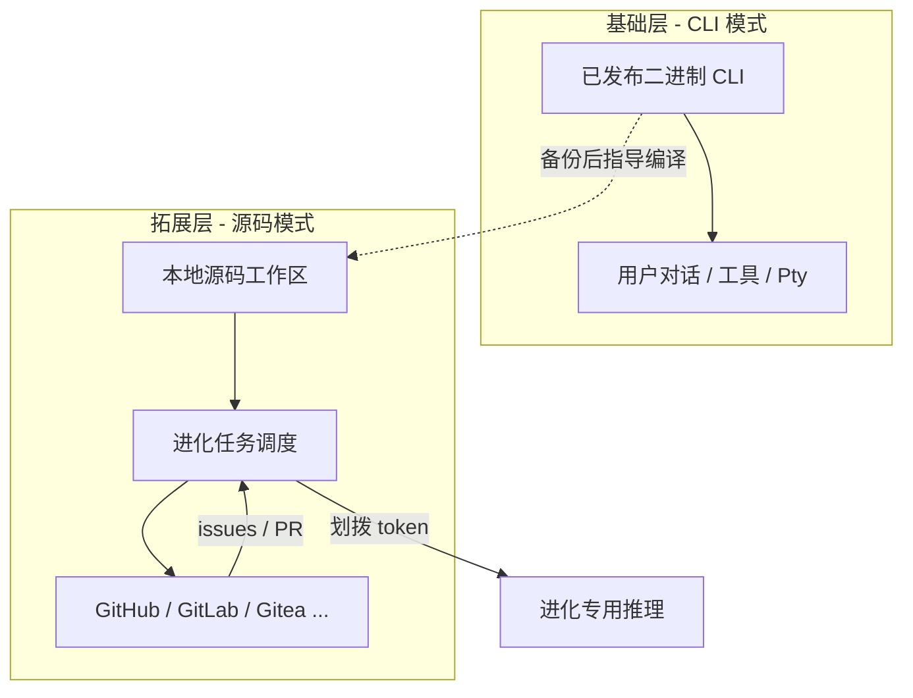
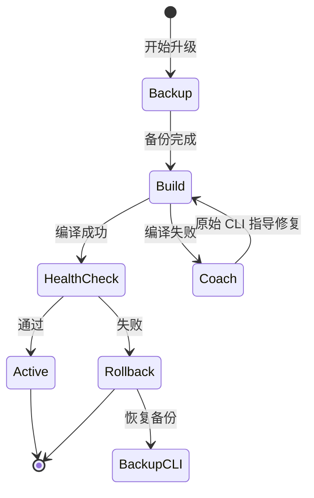
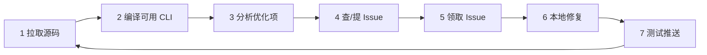

# 自我进化规则

本文档描述 Seven Chat Agent（及同类 Agent 运行时）的**双运行模式**与**源码模式下的自我进化闭环**。目标是：以稳定的二进制 CLI 为地基，在可控预算内让程序通过 Git 平台（GitHub 等）持续改进自身与所服务的项目。

---

## 1. 设计原则


| 原则          | 说明                                               |
| ----------- | ------------------------------------------------ |
| **CLI 为本**  | 日常推理、工具调用、用户交互默认走已发布的二进制 CLI；不依赖本地能否编译。          |
| **源码可拓**    | 源码模式是可选层：绑定具体仓库/分支/工作区，用于定制、调试与进化。               |
| **始终可回退**   | 任意升级或实验前，必须保留一份**经验证可用**的 CLI 环境（备份 + 健康检查）。     |
| **进化有预算**   | 启用源码模式后，从总 token 配额中**划拨固定比例**专用于进化任务，与用户对话隔离记账。 |
| **外环在 Git** | 问题发现、认领、协作、合入均在 Git 平台完成；本地只做执行与验证。              |


---

## 2. 双运行模式

### 2.1 CLI 模式（基础模式）

- **定义**：使用预编译、已发布的 CLI 二进制（或官方安装包）作为唯一执行入口。
- **职责**：
  - 对话、Judge、Pty/API/Assistant 等全部运行时能力；
  - 作为「教练」：在源码编译失败或测试不通过时，指导修复步骤；
  - 作为**安全网**：源码模式升级失败时，回退到该 CLI 继续服务。
- **配置示例**（概念）：
  - `runtime.mode = cli`
  - `cli.binary_path` / `cli.preset`（与现有 Pty 预设对齐）

### 2.2 源码模式（可拓展模式）

- **定义**：在 CLI 模式之上，挂载一个或多个**源码中心**（Git 远程仓库 + 本地工作副本），可配置项目路径、构建命令、测试命令。
- **职责**：
  - 从源码构建「进化用 CLI」或插件；
  - 静态/动态分析源码，提出优化项；
  - 与 Git 平台联动：查 issue、提 issue、领 issue、推分支/PR。
- **启用条件**（建议）：
  - 显式开关：`runtime.mode = source` 或 `source.enabled = true`；
  - 已配置 `source.remote_url`、`source.local_path`、`source.build`、`source.test`；
  - 可选：指定 `evolution.token_budget_ratio`（见 §3）。
- **与 CLI 模式关系**：**叠加而非替代**——源码模式运行时，底层仍须有一份可用的基础 CLI。




---

## 3. 进化 Token 预算

启用源码模式后，建议从全局或 per-friend 配额中划出独立池：


| 配置项                               | 含义                       |
| --------------------------------- | ------------------------ |
| `evolution.enabled`               | 是否允许自动进化任务               |
| `evolution.token_budget_ratio`    | 占总 token 上限的比例（如 5%～15%） |
| `evolution.token_budget_absolute` | 可选硬顶（防止比例在大配额下失控）        |
| `evolution.max_concurrent_tasks`  | 同时进行的问题解决数（默认 1）         |


**使用范围**（仅消耗进化池）：

- 源码拉取后的摘要与分析；
- Issue 文案生成、重复度比对、优先级打分；
- 本地 patch 生成、测试日志解读、PR 描述。

**不使用进化池**：普通用户聊天、群聊 Judge、记忆写入等——仍走主配额。

---

## 4. 自我进化七步流程

以下为标准外环（outer loop）；每一步应有日志、可中断、可人工审批闸门（可选）。

### 步骤 1：从源码中心下载源码到本地


| 项   | 说明                                                           |
| --- | ------------------------------------------------------------ |
| 输入  | 远程 URL、分支/标签、浅克隆深度                                           |
| 动作  | `git clone` / `git fetch` + `checkout` 到 `source.local_path` |
| 输出  | 一致性的工作树 + 当前 `commit` 记录                                     |
| 约束  | 支持多个源码中心（主仓 + fork）；记录 `upstream` 便于后续 PR                    |


### 步骤 2：确保源码编译后的 CLI 可用

**目标**：在不动坏生产的前提下，得到一份「来自源码」的可执行 CLI。

1. **备份原始 CLI**
  - 复制当前 `cli.binary_path` 到 `data/evolution/cli-backup/<timestamp>/`；  
  - 记录版本号、`--version` 输出、健康检查脚本结果。
2. **从源码构建**
  - 执行配置的 `source.build`（如 `cargo build --release`）；  
  - 构建产物路径写入 `source.built_binary_path`。
3. **健康检查**
  - 最小用例：启动、`--help`、一条端到端 smoke（与项目约定）。  
  - **失败时**：不替换正在使用的 CLI；调用**原始 CLI**（教练角色）分析构建日志，给出修复建议；可迭代构建，但**始终保留 backup 可一键恢复**。
4. **切换策略（建议）**
  - 仅当健康检查通过，才将「进化用 CLI」设为 `source.active_binary`；  
  - 用户对话可继续使用 backup CLI，直到人工确认或金丝雀期结束。




### 步骤 3：对源码进行分析，提出可优化项

- **分析维度**（可逐步落地）：
  - 静态：复杂度、重复、未使用导出、Clippy/ESLint 等等价物；
  - 架构：模块边界、与 `docs/` 设计文档的一致性；
  - 运行时：日志中的 error/warn 模式、测试覆盖率缺口；
  - 产品：与 README / 用户反馈相关的体验项。
- **输出**：结构化「可优化项」列表，每项含：标题、严重度初评、相关文件、建议改动方向、预估工作量。

### 步骤 4：在源码中心查找相似 Issue；无则创建

对每个可优化项：

1. 在远程检索：标题/标签/全文搜索相似 open issue；
2. **相似度判定**（LLM + 规则）：高于阈值则**关联已有 issue**，不重复创建；
3. 若无匹配：按模板创建新 issue（重现步骤、环境、建议标签）。

**本地 Issue 注册表**（见 §5.2）：即使云端已有相似项，若本地曾跟踪过，仍可提高「相关度」分数，避免重复劳动被误判为低优先级。

### 步骤 5：按优先级与能力领取 Issue

领取分数建议公式（可调参）：

```
score = w_sev * severity
      + w_rel * relevance(local_registry, issue)
      + w_fit * capability(self)
      - w_cost * estimated_effort
```


| 因子             | 说明                                                         |
| -------------- | ---------------------------------------------------------- |
| **severity**   | Issue 标签 / 类型映射：bug > security > perf > enhancement > docs |
| **relevance**  | 与当前项目、已修改模块、本地注册表的重合度；本地已记录的 issue 加分                      |
| **capability** | 历史已关闭 issue 类型、当前算力（GPU/并发）、进化 token 余量                    |
| **effort**     | 文件数、是否需迁移、是否缺测试                                            |


**领取动作**：在 Git 平台 assign self、加 `in-progress` 标签；本地记录 `claimed_at`、分支名。

### 步骤 6：本地解决问题

- 从 `main` / `develop` 拉取领取分支：`evolution/issue-<id>-<slug>`；
- 修改代码 + 必要文档/测试；
- 提交规范：`fix: ... (#123)` / `perf: ...`；
- 大改动可拆多个 commit，但保持 PR 原子性。

**约束**：

- 不修改与用户数据目录绑定的破坏性迁移，除非 issue 明确要求且有回滚方案；
- 敏感改动（认证、密钥）默认需人工批准闸门。

### 步骤 7：测试并推送到代码中心

1. **本地测试**：`source.test` + 项目 CI 等价脚本；
2. **可选**：在 PR 描述中附进化任务摘要、测试结果、token 消耗；
3. **推送**：`git push origin <branch>`，打开 Pull Request；
4. **闭环**：PR 合并后，触发步骤 1～2 的「再同步 + 再编译」，更新本地进化用 CLI；
5. **归档**：关闭本地 issue 记录；更新 capability 画像（已解决问题类型）。




---

## 5. 本地状态与数据模型（建议）

### 5.1 目录布局

```
{SEVEN_CHAT_AGENT_DATA}/
  evolution/
    cli-backup/           # 原始 CLI 备份
    workspaces/           # 各源码中心的工作副本
    registry.json         # 本地 issue 注册表与领取记录
    runs/                 # 每次进化任务日志与 token 消耗
```

### 5.2 本地 Issue 注册表（`registry.json` 概念）

```json
{
  "issues": [
    {
      "local_id": "evo-2026-001",
      "remote_url": "https://github.com/org/repo/issues/42",
      "first_seen_at": "2026-06-01T10:00:00Z",
      "relevance_notes": "与 Pty 工作区切换相关",
      "relevance_boost": 0.3,
      "status": "claimed|fixed|wontfix",
      "related_paths": ["crates/.../pty.rs"]
    }
  ],
  "capability": {
    "closed_labels": ["bug", "docs"],
    "avg_tokens_per_fix": 12000
  }
}
```

**规则**：云端存在相似 issue 时，若 `local_id` 已存在且 `related_paths` 重叠，则 `relevance_boost` 累加，避免「公共 issue 抢不过他人」时本地仍优先处理与自己历史相关的问题。

---

## 6. 安全与治理


| 风险              | 对策                                        |
| --------------- | ----------------------------------------- |
| 编译产物不可信         | 仅执行配置的 build 脚本；禁止任意 shell                |
| 进化任务占满配额        | 硬顶 + 比例双限；低余额时暂停领取                        |
| 恶意 issue / 依赖投毒 | 仅处理 trusted org 仓库；PR 需 CI 绿 + 可选人工 merge |
| 用户数据泄露          | 进化分支不得上传 `.env`、`data/`、密钥                |
| CLI 被覆盖损坏       | 强制 backup；健康检查失败禁止切换 active               |


**审批闸门（推荐默认开启）**：

- 创建 issue 前：预览文案；
- `git push` / 开 PR 前：diff 摘要确认；
- 替换生产 CLI 前：人工一键确认。

---

## 7. 与现有 Seven Chat Agent 的映射（草案）


| 现有能力                             | 进化规则中的角色                   |
| -------------------------------- | -------------------------- |
| Pty + `worker-bee` / `codex` CLI | 基础 CLI 模式、教练 CLI           |
| `workspaces` + `cli_sessions`    | 源码模式可 per-workspace 绑定不同仓库 |
| `cli-relay`                      | 远程机器上的进化构建与测试              |
| Provider `vision` / 附件           | 进化分析可读 issue 截图、CI 日志附件    |
| `SEVEN_CHAT_AGENT_DATA`          | 存放 backup、registry、进化日志    |


**已实现（E0～E2，见 [自我进化开发计划](./自我进化开发计划.md)）**：

- `data/evolution/settings.json` 配置与 HTTP `/api/evolution/*`；
- 步骤 1～2：git 同步、CLI 备份、编译、`--help` 健康检查、运行日志；
- 步骤 3～4：工作区静态分析、可选 LLM 增强、`registry.json` 与 GitHub Issue 查重/创建（默认创建需审批）；
- 助理面板「自我进化」页可手动触发 ①～④ 及串联。

**尚未实现**（E3～E4）：

- 打分领取、patch、PR 与审批闸门；
- 与 assistant 队列定时集成。

---

## 8. 配置示例（概念 YAML）

```yaml
runtime:
  mode: source          # cli | source

cli:
  binary_path: /usr/local/bin/seven-chat-agent-cli
  preset: worker-bee

source:
  remote_url: https://github.com/example/seven-chat-agent.git
  branch: main
  local_path: data/evolution/workspaces/seven-chat-agent
  build: cargo build --release -p seven-chat-agent-cli
  test: cargo test --workspace
  built_binary_path: target/release/seven-chat-agent-cli

evolution:
  enabled: true
  token_budget_ratio: 0.10
  token_budget_absolute: 500000
  git_platform: github
  trusted_orgs: [example]
  require_approval_before_push: true
```

---

## 9. 演进路线（建议分期）


| 阶段     | 内容                             |
| ------ | ------------------------------ |
| **E0** | 文档 + 配置 schema；手动执行七步，工具仅辅助脚本  |
| **E1** | 自动 1～2（拉源码、备份、编译、健康检查、回退）      |
| **E2** | 自动 3～4（分析 + 查/提 issue），人工领取    |
| **E3** | 自动 5～7（打分领取、patch、测试、PR），审批闸门  |
| **E4** | 多仓、多 agent 分工、与 assistant 队列集成 |


---

## 10. 术语表


| 术语         | 含义                            |
| ---------- | ----------------------------- |
| **源码中心**   | 托管源码的 Git 远程（GitHub/GitLab 等） |
| **基础 CLI** | 发布二进制，进化失败时的回退环境              |
| **进化 CLI** | 从当前源码成功编译出的候选二进制              |
| **进化池**    | 划拨给自我进化任务的 token 配额           |
| **外环**     | 七步 Git 协作流程                   |
| **内环**     | 单次 issue 内的分析→修复→测试           |


---

*文档版本：2026-06-01 · 状态：设计草案，待评审后拆 implementation issues。*